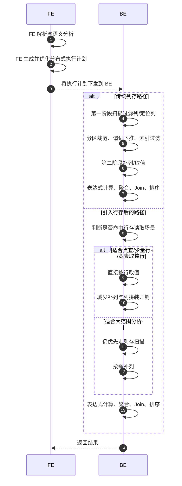

```mermaid
```mermaid
sequenceDiagram
    autonumber

    participant FE
    participant BE

    FE->>FE: FE 解析与语义分析
    FE->>FE: FE 生成并优化分布式执行计划
    FE-->>BE: 将执行计划下发到 BE

    alt 传统列存路径
        BE->>BE: 第一阶段扫描过滤列/定位列
        BE->>BE: 分区裁剪、谓词下推、索引过滤
        BE->>BE: 第二阶段补列/取值
        BE->>BE: 表达式计算、聚合、Join、排序
    else 引入行存后的路径
        BE->>BE: 判断是否命中行存读取场景
        alt 适合点查/少量行/宽表取整行
            BE->>BE: 直接按行取值
            BE->>BE: 减少补列与列拼装开销
        else 适合大范围分析
            BE->>BE: 仍优先走列存扫描
            BE->>BE: 按需补列
        end
        BE->>BE: 表达式计算、聚合、Join、排序
    end

    BE-->>FE: 返回结果

```
```