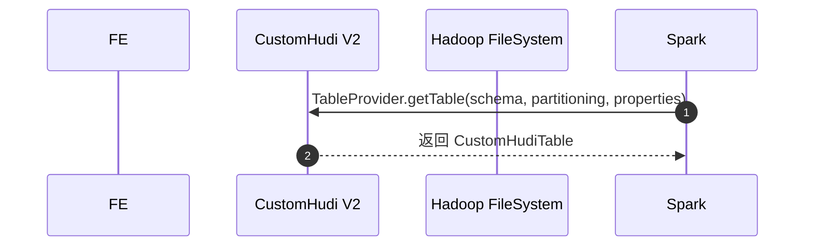

```mermaid
sequenceDiagram
    autonumber

    participant FE
    participant DSv2 as CustomHudi V2
    participant Storage as Hadoop FileSystem

    Spark->>DSv2: TableProvider.getTable(schema, partitioning, properties)
    DSv2-->>Spark: 返回 CustomHudiTable
```