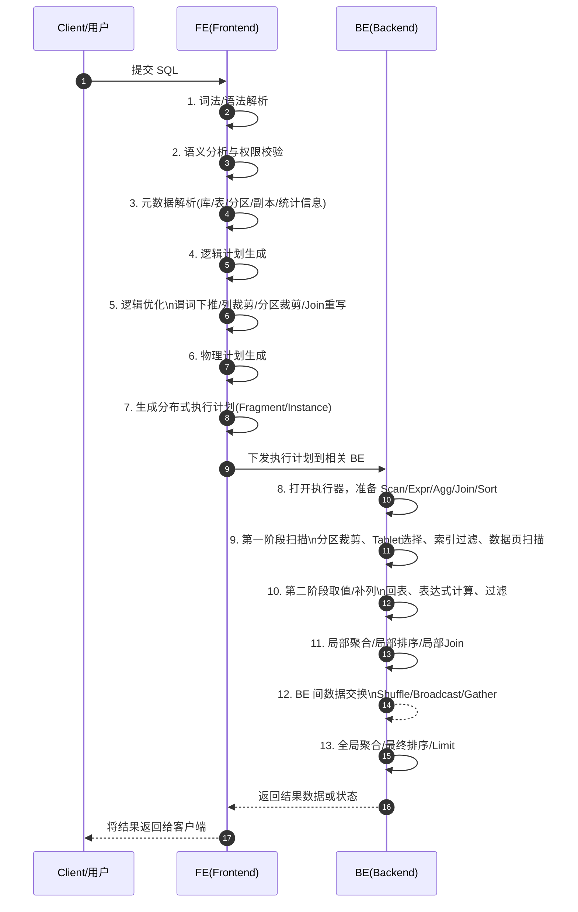

```mermaid
sequenceDiagram
    autonumber

    participant Client as Client/用户
    participant FE as FE(Frontend)
    participant BE as BE(Backend)

    Client->>FE: 提交 SQL
    FE->>FE: 1. 词法/语法解析
    FE->>FE: 2. 语义分析与权限校验
    FE->>FE: 3. 元数据解析(库/表/分区/副本/统计信息)
    FE->>FE: 4. 逻辑计划生成
    FE->>FE: 5. 逻辑优化\n谓词下推/列裁剪/分区裁剪/Join重写
    FE->>FE: 6. 物理计划生成
    FE->>FE: 7. 生成分布式执行计划(Fragment/Instance)
    FE->>BE: 下发执行计划到相关 BE
    BE->>BE: 8. 打开执行器，准备 Scan/Expr/Agg/Join/Sort
    BE->>BE: 9. 第一阶段扫描\n分区裁剪、Tablet选择、索引过滤、数据页扫描
    BE->>BE: 10. 第二阶段取值/补列\n回表、表达式计算、过滤
    BE->>BE: 11. 局部聚合/局部排序/局部Join
    BE-->>BE: 12. BE 间数据交换\nShuffle/Broadcast/Gather
    BE->>BE: 13. 全局聚合/最终排序/Limit
    BE-->>FE: 返回结果数据或状态
    FE-->>Client: 将结果返回给客户端

```