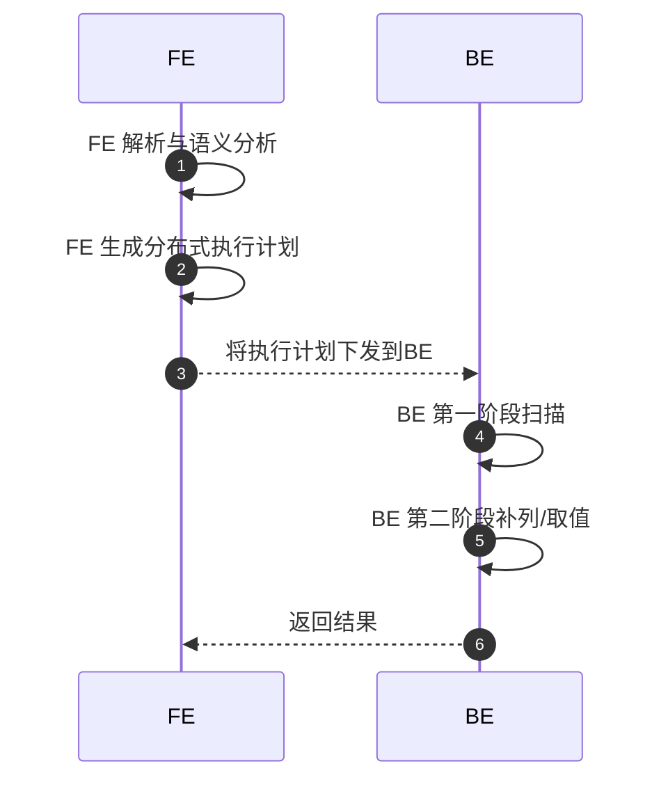

```mermaid
sequenceDiagram
    autonumber

    participant FE
    participant BE

    FE->>FE: FE 解析与语义分析
    FE->>FE: FE 生成分布式执行计划
    FE-->>BE: 将执行计划下发到BE
    BE->>BE: BE 第一阶段扫描
    BE->>BE: BE 第二阶段补列/取值
    BE-->>FE: 返回结果
    

```