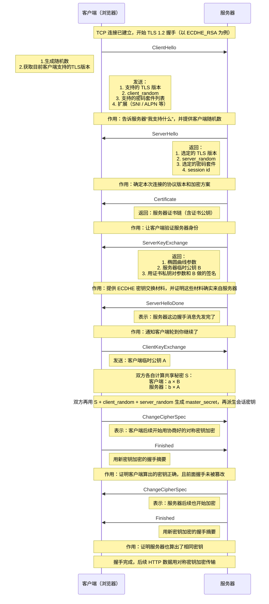

```mermaid
sequenceDiagram
    participant C as 客户端（浏览器）
    participant S as 服务器

    Note over C,S: TCP 连接已建立，开始 TLS 1.2 握手（以 ECDHE_RSA 为例）

    C->>S: ClientHello
    Note left of C: 1.生成随机数<br/> 2.获取目前客户端支持的TLS版本 
    Note right of C: 发送：<br/>1. 支持的 TLS 版本<br/>2. client_random<br/>3. 支持的密码套件列表<br/>4. 扩展（SNI / ALPN 等）
    Note over C,S: 作用：告诉服务器“我支持什么”，并提供客户端随机数

    S->>C: ServerHello
    Note left of S: 返回：<br/>1. 选定的 TLS 版本<br/>2. server_random<br/>3. 选定的密码套件<br/>4. session id
    Note over C,S: 作用：确定本次连接的协议版本和加密方案

    S->>C: Certificate
    Note left of S: 返回：服务器证书链（含证书公钥）
    Note over C,S: 作用：让客户端验证服务器身份

    S->>C: ServerKeyExchange
    Note left of S: 返回：<br/>1. 椭圆曲线参数<br/>2. 服务器临时公钥 B<br/>3. 用证书私钥对参数和 B 做的签名
    Note over C,S: 作用：提供 ECDHE 密钥交换材料，并证明这些材料确实来自服务器

    S->>C: ServerHelloDone
    Note left of S: 表示：服务器这边握手消息先发完了
    Note over C,S: 作用：通知客户端轮到你继续了

    C->>S: ClientKeyExchange
    Note right of C: 发送：客户端临时公钥 A
    Note over C,S: 双方各自计算共享秘密 S：<br/>客户端：a × B<br/>服务器：b × A

    Note over C,S: 双方再用 S + client_random + server_random 生成 master_secret，再派生会话密钥

    C->>S: ChangeCipherSpec
    Note right of C: 表示：客户端后续开始用协商好的对称密钥加密

    C->>S: Finished
    Note right of C: 用新密钥加密的握手摘要
    Note over C,S: 作用：证明客户端算出的密钥正确，且前面握手未被篡改

    S->>C: ChangeCipherSpec
    Note left of S: 表示：服务器后续也开始加密

    S->>C: Finished
    Note left of S: 用新密钥加密的握手摘要
    Note over C,S: 作用：证明服务器也算出了相同密钥

    Note over C,S: 握手完成，后续 HTTP 数据用对称密钥加密传输
```