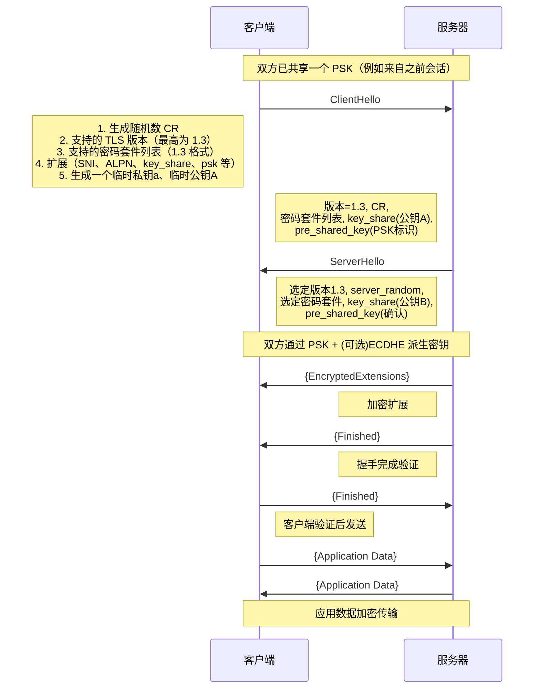

```mermaid
sequenceDiagram
    participant C as 客户端
    participant S as 服务器

    Note over C,S: 双方已共享一个 PSK（例如来自之前会话）

    C->>S: ClientHello
    Note left of C: 1. 生成随机数 CR<br/> 2. 支持的 TLS 版本（最高为 1.3）<br/> 3. 支持的密码套件列表（1.3 格式）<br/> 4. 扩展（SNI、ALPN、key_share、psk 等）<br/> 5. 生成一个临时私钥a、临时公钥A
    Note right of C: 版本=1.3, CR,<br/> 密码套件列表, key_share(公钥A),<br/> pre_shared_key(PSK标识)

    S->>C: ServerHello
    Note left of S: 选定版本1.3, server_random,<br/> 选定密码套件, key_share(公钥B),<br/> pre_shared_key(确认)

    Note over C,S: 双方通过 PSK + (可选)ECDHE 派生密钥

    S->>C: {EncryptedExtensions}
    Note left of S: 加密扩展

    S->>C: {Finished}
    Note left of S: 握手完成验证

    C->>S: {Finished}
    Note right of C: 客户端验证后发送

    C->>S: {Application Data}
    S->>C: {Application Data}
    Note over C,S: 应用数据加密传输
```