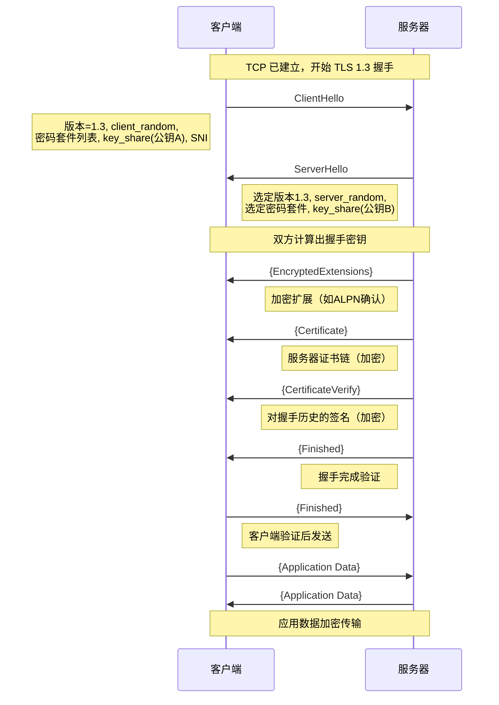

```mermaid
sequenceDiagram
    participant C as 客户端
    participant S as 服务器

    Note over C,S: TCP 已建立，开始 TLS 1.3 握手

    C->>S: ClientHello
    Note left of C: 版本=1.3, client_random,<br/> 密码套件列表, key_share(公钥A), SNI

    S->>C: ServerHello
    Note left of S: 选定版本1.3, server_random,<br/> 选定密码套件, key_share(公钥B)

    Note over C,S: 双方计算出握手密钥

    S->>C: {EncryptedExtensions}
    Note left of S: 加密扩展（如ALPN确认）

    S->>C: {Certificate}
    Note left of S: 服务器证书链（加密）

    S->>C: {CertificateVerify}
    Note left of S: 对握手历史的签名（加密）

    S->>C: {Finished}
    Note left of S: 握手完成验证

    C->>S: {Finished}
    Note right of C: 客户端验证后发送

    C->>S: {Application Data}
    S->>C: {Application Data}
    Note over C,S: 应用数据加密传输
```