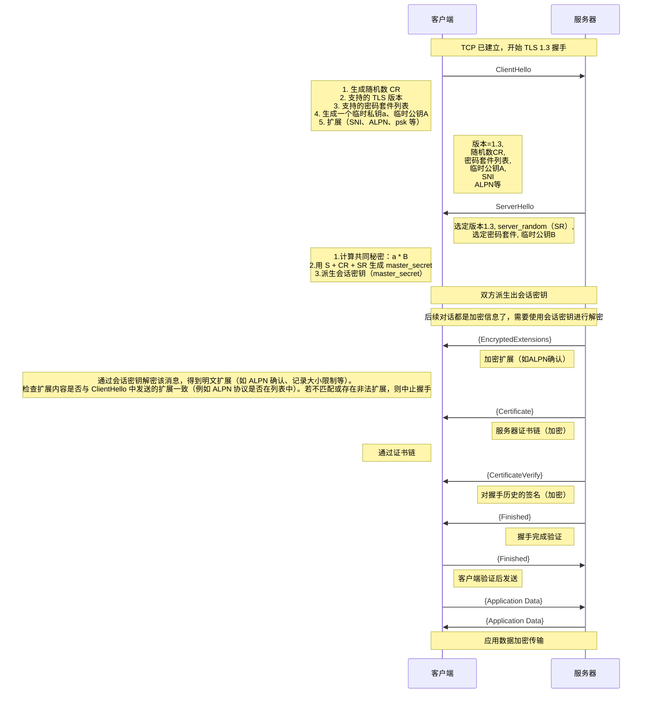

```mermaid
sequenceDiagram
    participant C as 客户端
    participant S as 服务器

    Note over C,S: TCP 已建立，开始 TLS 1.3 握手

    C->>S: ClientHello
    Note left of C: 1. 生成随机数 CR<br/> 2. 支持的 TLS 版本<br/> 3. 支持的密码套件列表<br/> 4. 生成一个临时私钥a、临时公钥A<br/> 5. 扩展（SNI、ALPN、psk 等）
    Note right of C: 版本=1.3,<br/> 随机数CR,<br/> 密码套件列表,<br/> 临时公钥A,<br/> SNI<br/> ALPN等

    S->>C: ServerHello
    Note left of S: 选定版本1.3, server_random（SR）,<br/> 选定密码套件, 临时公钥B
    Note left of C: 1.计算共同秘密：a * B<br/> 2.用 S + CR + SR 生成 master_secret<br/> 3.派生会话密钥（master_secret）

    Note over C,S: 双方派生出会话密钥
    Note over C,S: 后续对话都是加密信息了，需要使用会话密钥进行解密

    S->>C: {EncryptedExtensions}
    Note left of S: 加密扩展（如ALPN确认）
    Note left of C: 通过会话密钥解密该消息，得到明文扩展（如 ALPN 确认、记录大小限制等）。<br/>检查扩展内容是否与 ClientHello 中发送的扩展一致（例如 ALPN 协议是否在列表中）。若不匹配或存在非法扩展，则中止握手

    S->>C: {Certificate}
    Note left of S: 服务器证书链（加密）
    Note left of C: 通过证书链

    S->>C: {CertificateVerify}
    Note left of S: 对握手历史的签名（加密）

    S->>C: {Finished}
    Note left of S: 握手完成验证

    C->>S: {Finished}
    Note right of C: 客户端验证后发送

    C->>S: {Application Data}
    S->>C: {Application Data}
    Note over C,S: 应用数据加密传输
```