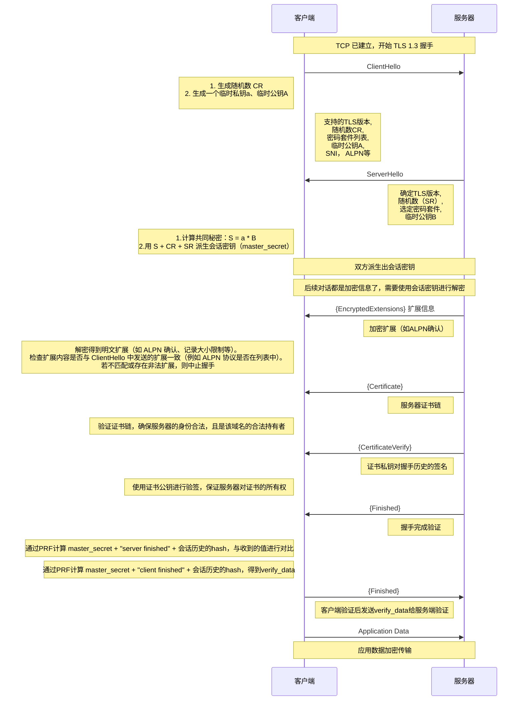

```mermaid
sequenceDiagram
    participant C as 客户端
    participant S as 服务器

    Note over C,S: TCP 已建立，开始 TLS 1.3 握手

    C->>S: ClientHello
    Note left of C: 1. 生成随机数 CR<br/> 2. 生成一个临时私钥a、临时公钥A<br/>
    Note right of C: 支持的TLS版本,<br/> 随机数CR,<br/> 密码套件列表,<br/> 临时公钥A,<br/> SNI， ALPN等

    S->>C: ServerHello
    Note left of S: 确定TLS版本, <br/>随机数（SR）,<br/> 选定密码套件, <br/>临时公钥B
    Note left of C: 1.计算共同秘密：S = a * B<br/> 2.用 S + CR + SR 派生会话密钥（master_secret）

    Note over C,S: 双方派生出会话密钥
    Note over C,S: 后续对话都是加密信息了，需要使用会话密钥进行解密

    S->>C: {EncryptedExtensions} 扩展信息
    Note left of S: 加密扩展（如ALPN确认）
    Note left of C: 解密得到明文扩展（如 ALPN 确认、记录大小限制等）。<br/>检查扩展内容是否与 ClientHello 中发送的扩展一致（例如 ALPN 协议是否在列表中）。<br/> 若不匹配或存在非法扩展，则中止握手

    S->>C: {Certificate}
    Note left of S: 服务器证书链
    Note left of C: 验证证书链，确保服务器的身份合法，且是该域名的合法持有者

    S->>C: {CertificateVerify}
    Note left of S: 证书私钥对握手历史的签名
    Note left of C: 使用证书公钥进行验签，保证服务器对证书的所有权

    S->>C: {Finished}
    Note left of S: 握手完成验证
    Note left of C: 通过PRF计算 master_secret + "server finished" + 会话历史的hash，与收到的值进行对比
    Note left of C: 通过PRF计算 master_secret + "client finished" + 会话历史的hash，得到verify_data

    C->>S: {Finished}
    Note right of C: 客户端验证后发送verify_data给服务端验证

    C->>S: Application Data
    Note over C,S: 应用数据加密传输
```