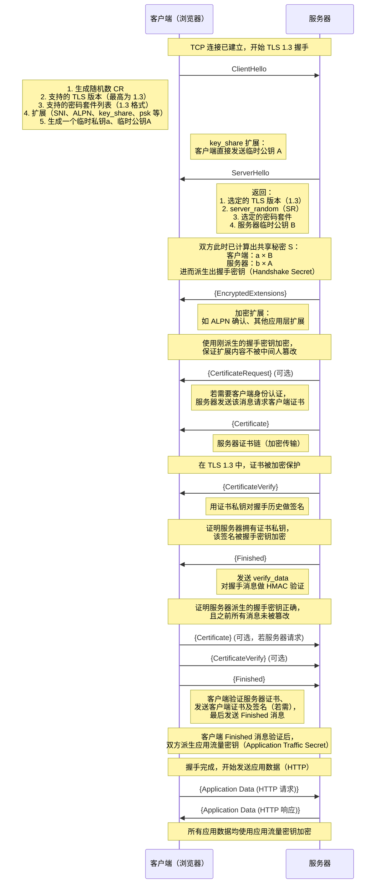

```mermaid
sequenceDiagram
    participant C as 客户端（浏览器）
    participant S as 服务器

    Note over C,S: TCP 连接已建立，开始 TLS 1.3 握手

    C->>S: ClientHello
    Note left of C: 1. 生成随机数 CR<br/> 2. 支持的 TLS 版本（最高为 1.3）<br/> 3. 支持的密码套件列表（1.3 格式）<br/> 4. 扩展（SNI、ALPN、key_share、psk 等）<br/> 5. 生成一个临时私钥a、临时公钥A
    Note right of C: key_share 扩展：<br/> 客户端直接发送临时公钥 A

    S->>C: ServerHello
    Note left of S: 返回：<br/> 1. 选定的 TLS 版本（1.3）<br/> 2. server_random（SR）<br/> 3. 选定的密码套件<br/> 4. 服务器临时公钥 B
    Note over C,S: 双方此时已计算出共享秘密 S：<br/> 客户端：a × B<br/> 服务器：b × A<br/> 进而派生出握手密钥（Handshake Secret）

    S->>C: {EncryptedExtensions}
    Note left of S: 加密扩展：<br/> 如 ALPN 确认、其他应用层扩展
    Note over C,S: 使用刚派生的握手密钥加密，<br/> 保证扩展内容不被中间人篡改

    S->>C: {CertificateRequest} (可选)
    Note left of S: 若需要客户端身份认证，<br/> 服务器发送该消息请求客户端证书

    S->>C: {Certificate}
    Note left of S: 服务器证书链（加密传输）
    Note over C,S: 在 TLS 1.3 中，证书被加密保护

    S->>C: {CertificateVerify}
    Note left of S: 用证书私钥对握手历史做签名
    Note over C,S: 证明服务器拥有证书私钥，<br/> 该签名被握手密钥加密

    S->>C: {Finished}
    Note left of S: 发送 verify_data<br/> 对握手消息做 HMAC 验证
    Note over C,S: 证明服务器派生的握手密钥正确，<br/> 且之前所有消息未被篡改

    C->>S: {Certificate} (可选，若服务器请求)
    C->>S: {CertificateVerify} (可选)
    C->>S: {Finished}
    Note right of C: 客户端验证服务器证书、<br/> 发送客户端证书及签名（若需），<br/> 最后发送 Finished 消息
    Note over C,S: 客户端 Finished 消息验证后，<br/> 双方派生应用流量密钥（Application Traffic Secret）

    Note over C,S: 握手完成，开始发送应用数据（HTTP）

    C->>S: {Application Data (HTTP 请求)}
    S->>C: {Application Data (HTTP 响应)}
    Note over C,S: 所有应用数据均使用应用流量密钥加密
```