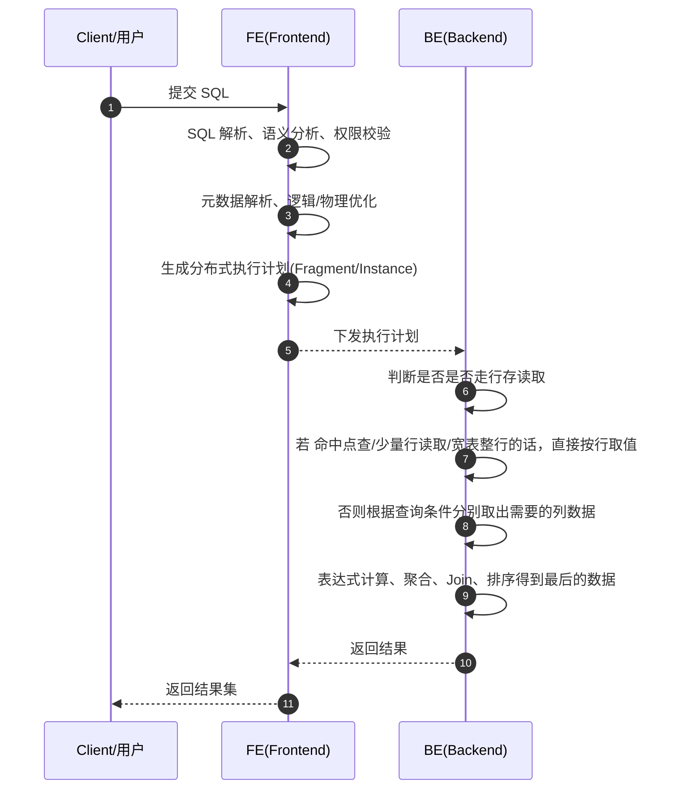

```mermaid
sequenceDiagram
    autonumber

    participant Client as Client/用户
    participant FE as FE(Frontend)
    participant BE as BE(Backend)
    
    Client->>FE: 提交 SQL
    FE->>FE: SQL 解析、语义分析、权限校验
    FE->>FE: 元数据解析、逻辑/物理优化
    FE->>FE: 生成分布式执行计划(Fragment/Instance)
    FE-->>BE: 下发执行计划

    BE->>BE: 判断是否是否走行存读取
    BE->>BE: 若 命中点查/少量行读取/宽表整行的话，直接按行取值
    BE->>BE: 否则根据查询条件分别取出需要的列数据
    BE->>BE: 表达式计算、聚合、Join、排序得到最后的数据

    BE-->>FE: 返回结果
    FE-->>Client: 返回结果集


```