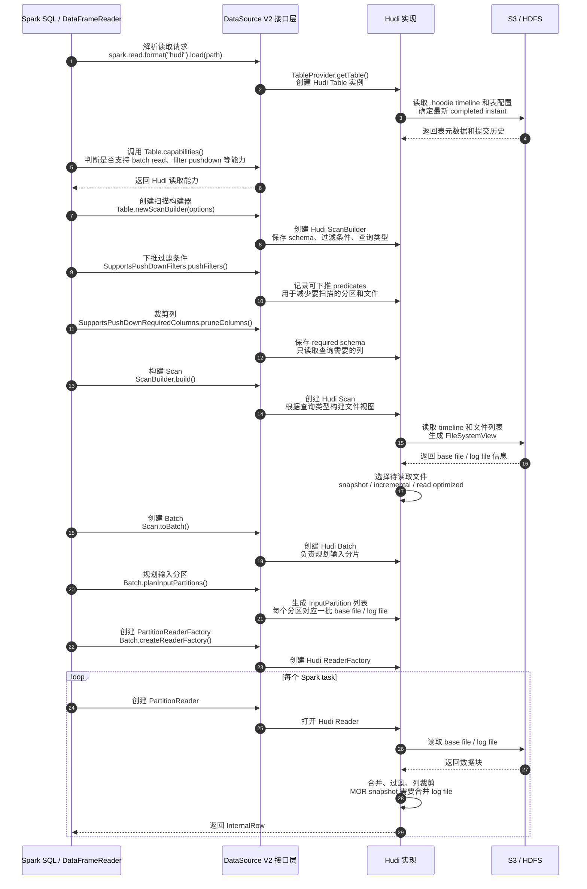

```mermaid
sequenceDiagram
    autonumber

    participant Spark as Spark SQL / DataFrameReader
    participant DS as DataSource V2 接口层
    participant Hudi as Hudi 实现
    participant Storage as S3 / HDFS

    Spark ->> DS: 解析读取请求<br/>spark.read.format("hudi").load(path)
    DS ->> Hudi: TableProvider.getTable()<br/>创建 Hudi Table 实例

    Hudi ->> Storage: 读取 .hoodie timeline 和表配置<br/>确定最新 completed instant
    Storage -->> Hudi: 返回表元数据和提交历史

    Spark ->> DS: 调用 Table.capabilities()<br/>判断是否支持 batch read、filter pushdown 等能力
    DS -->> Spark: 返回 Hudi 读取能力

    Spark ->> DS: 创建扫描构建器<br/>Table.newScanBuilder(options)
    DS ->> Hudi: 创建 Hudi ScanBuilder<br/>保存 schema、过滤条件、查询类型

    Spark ->> DS: 下推过滤条件<br/>SupportsPushDownFilters.pushFilters()
    DS ->> Hudi: 记录可下推 predicates<br/>用于减少要扫描的分区和文件

    Spark ->> DS: 裁剪列<br/>SupportsPushDownRequiredColumns.pruneColumns()
    DS ->> Hudi: 保存 required schema<br/>只读取查询需要的列

    Spark ->> DS: 构建 Scan<br/>ScanBuilder.build()
    DS ->> Hudi: 创建 Hudi Scan<br/>根据查询类型构建文件视图

    Hudi ->> Storage: 读取 timeline 和文件列表<br/>生成 FileSystemView
    Storage -->> Hudi: 返回 base file / log file 信息

    Hudi ->> Hudi: 选择待读取文件<br/>snapshot / incremental / read optimized

    Spark ->> DS: 创建 Batch<br/>Scan.toBatch()
    DS ->> Hudi: 创建 Hudi Batch<br/>负责规划输入分片

    Spark ->> DS: 规划输入分区<br/>Batch.planInputPartitions()
    DS ->> Hudi: 生成 InputPartition 列表<br/>每个分区对应一批 base file / log file

    Spark ->> DS: 创建 PartitionReaderFactory<br/>Batch.createReaderFactory()
    DS ->> Hudi: 创建 Hudi ReaderFactory

    loop 每个 Spark task
        Spark ->> DS: 创建 PartitionReader
        DS ->> Hudi: 打开 Hudi Reader

        Hudi ->> Storage: 读取 base file / log file
        Storage -->> Hudi: 返回数据块

        Hudi ->> Hudi: 合并、过滤、列裁剪<br/>MOR snapshot 需要合并 log file
        Hudi -->> Spark: 返回 InternalRow
    end

```