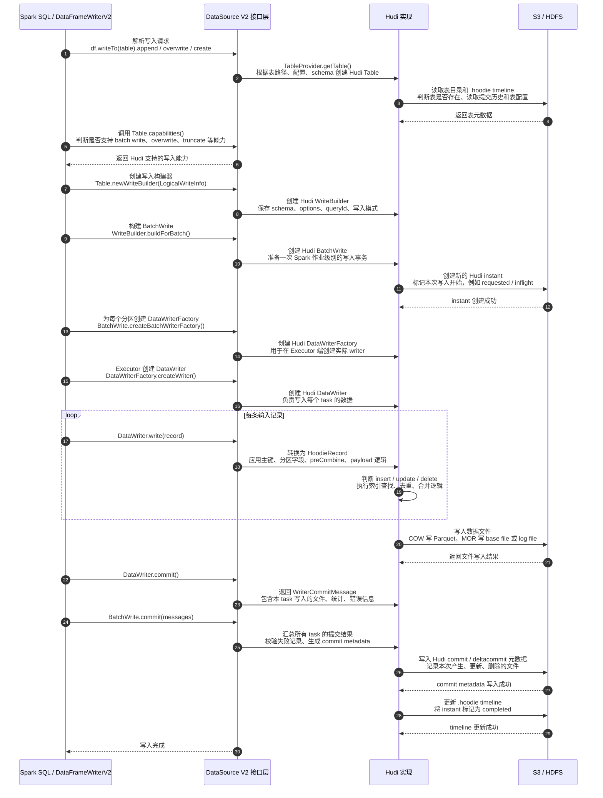

```mermaid
sequenceDiagram
    autonumber

    participant Spark as Spark SQL / DataFrameWriterV2
    participant DS as DataSource V2 接口层
    participant Hudi as Hudi 实现
    participant Storage as S3 / HDFS

    Spark ->> DS: 解析写入请求<br/>df.writeTo(table).append / overwrite / create
    DS ->> Hudi: TableProvider.getTable()<br/>根据表路径、配置、schema 创建 Hudi Table

    Hudi ->> Storage: 读取表目录和 .hoodie timeline<br/>判断表是否存在、读取提交历史和表配置
    Storage -->> Hudi: 返回表元数据

    Spark ->> DS: 调用 Table.capabilities()<br/>判断是否支持 batch write、overwrite、truncate 等能力
    DS -->> Spark: 返回 Hudi 支持的写入能力

    Spark ->> DS: 创建写入构建器<br/>Table.newWriteBuilder(LogicalWriteInfo)
    DS ->> Hudi: 创建 Hudi WriteBuilder<br/>保存 schema、options、queryId、写入模式

    Spark ->> DS: 构建 BatchWrite<br/>WriteBuilder.buildForBatch()
    DS ->> Hudi: 创建 Hudi BatchWrite<br/>准备一次 Spark 作业级别的写入事务

    Hudi ->> Storage: 创建新的 Hudi instant<br/>标记本次写入开始，例如 requested / inflight
    Storage -->> Hudi: instant 创建成功

    Spark ->> DS: 为每个分区创建 DataWriterFactory<br/>BatchWrite.createBatchWriterFactory()
    DS ->> Hudi: 创建 Hudi DataWriterFactory<br/>用于在 Executor 端创建实际 writer

    Spark ->> DS: Executor 创建 DataWriter<br/>DataWriterFactory.createWriter()
    DS ->> Hudi: 创建 Hudi DataWriter<br/>负责写入每个 task 的数据

    loop 每条输入记录
        Spark ->> DS: DataWriter.write(record)
        DS ->> Hudi: 转换为 HoodieRecord<br/>应用主键、分区字段、preCombine、payload 逻辑
        Hudi ->> Hudi: 判断 insert / update / delete<br/>执行索引查找、去重、合并逻辑
    end

    Hudi ->> Storage: 写入数据文件<br/>COW 写 Parquet，MOR 写 base file 或 log file
    Storage -->> Hudi: 返回文件写入结果

    Spark ->> DS: DataWriter.commit()
    DS ->> Hudi: 返回 WriterCommitMessage<br/>包含本 task 写入的文件、统计、错误信息

    Spark ->> DS: BatchWrite.commit(messages)
    DS ->> Hudi: 汇总所有 task 的提交结果<br/>校验失败记录、生成 commit metadata

    Hudi ->> Storage: 写入 Hudi commit / deltacommit 元数据<br/>记录本次产生、更新、删除的文件
    Storage -->> Hudi: commit metadata 写入成功

    Hudi ->> Storage: 更新 .hoodie timeline<br/>将 instant 标记为 completed
    Storage -->> Hudi: timeline 更新成功

    DS -->> Spark: 写入完成
```