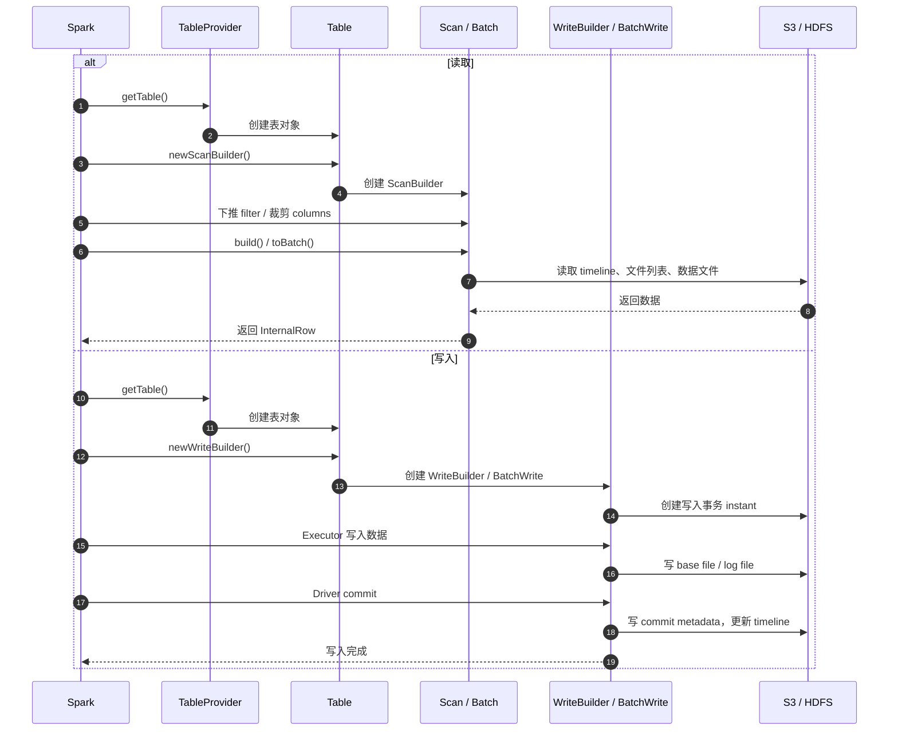

```mermaid
sequenceDiagram
    autonumber

    participant Spark
    participant Provider as TableProvider
    participant Table
    participant Read as Scan / Batch
    participant Write as WriteBuilder / BatchWrite
    participant Storage as S3 / HDFS

    alt 读取
        Spark ->> Provider: getTable()
        Provider ->> Table: 创建表对象

        Spark ->> Table: newScanBuilder()
        Table ->> Read: 创建 ScanBuilder

        Spark ->> Read: 下推 filter / 裁剪 columns
        Spark ->> Read: build() / toBatch()
        Read ->> Storage: 读取 timeline、文件列表、数据文件
        Storage -->> Read: 返回数据
        Read -->> Spark: 返回 InternalRow
    else 写入
        Spark ->> Provider: getTable()
        Provider ->> Table: 创建表对象

        Spark ->> Table: newWriteBuilder()
        Table ->> Write: 创建 WriteBuilder / BatchWrite

        Write ->> Storage: 创建写入事务 instant
        Spark ->> Write: Executor 写入数据
        Write ->> Storage: 写 base file / log file
        Spark ->> Write: Driver commit
        Write ->> Storage: 写 commit metadata，更新 timeline
        Write -->> Spark: 写入完成
    end

```