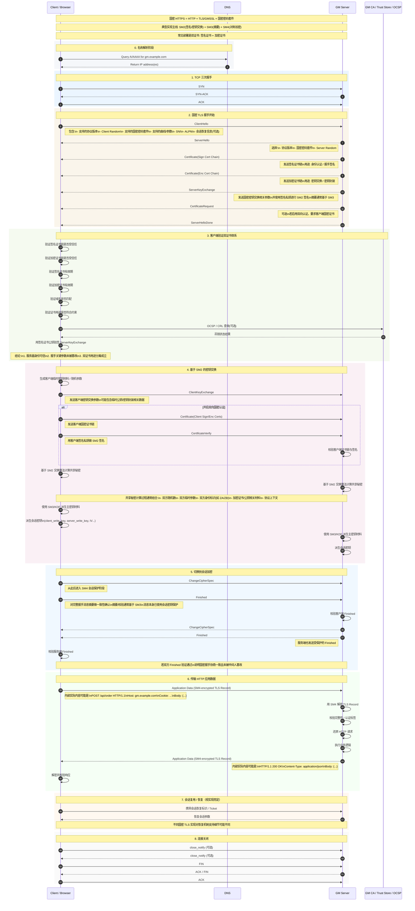

```mermaid
sequenceDiagram
    autonumber
    participant C as Client / Browser
    participant D as DNS
    participant S as GM Server
    participant GCA as GM CA / Trust Store / OCSP

    Note over C,S: 国密 HTTPS = HTTP + TLS/GMSSL + 国密密码套件
    Note over C,S: 典型实现主线: SM2(签名/密钥交换) + SM3(摘要) + SM4(对称加密)
    Note over C,S: 常见部署是双证书: 签名证书 + 加密证书

    rect rgb(245, 247, 250)
        Note over C,D: 0. 名称解析阶段
        C->>D: Query A/AAAA for gm.example.com
        D-->>C: Return IP address(es)
    end

    rect rgb(235, 245, 255)
        Note over C,S: 1. TCP 三次握手
        C->>S: SYN
        S-->>C: SYN-ACK
        C->>S: ACK
    end

    rect rgb(250, 245, 235)
        Note over C,S: 2. 国密 TLS 握手开始
        C->>S: ClientHello
        Note right of C: 包含:\n- 支持的协议版本\n- Client Random\n- 支持的国密密码套件\n- 支持的曲线/参数\n- SNI\n- ALPN\n- 会话恢复信息(可选)

        S-->>C: ServerHello
        Note left of S: 选择:\n- 协议版本\n- 国密密码套件\n- Server Random

        S-->>C: Certificate(Sign Cert Chain)
        Note left of S: 发送签名证书链\n用途: 身份认证 / 握手签名

        S-->>C: Certificate(Enc Cert Chain)
        Note left of S: 发送加密证书链\n用途: 密钥交换 / 密钥封装

        S-->>C: ServerKeyExchange
        Note left of S: 发送国密密钥交换相关参数\n并使用签名私钥进行 SM2 签名\n摘要通常基于 SM3

        S-->>C: CertificateRequest
        Note left of S: 可选\n若启用双向认证，要求客户端国密证书

        S-->>C: ServerHelloDone
    end

    rect rgb(245, 250, 240)
        Note over C,GCA: 3. 客户端验证双证书体系
        C->>C: 验证签名证书链是否受信任
        C->>C: 验证加密证书链是否受信任
        C->>C: 验证签名证书有效期
        C->>C: 验证加密证书有效期
        C->>C: 验证域名是否匹配
        C->>C: 验证证书用途是否符合约束
        C->>GCA: OCSP / CRL 查询(可选)
        GCA-->>C: 吊销状态结果
        C->>C: 用签名证书公钥验签 ServerKeyExchange
        Note over C: 结论:\n1. 服务器身份可信\n2. 握手关键参数未被篡改\n3. 双证书用途分离成立
    end

    rect rgb(250, 240, 245)
        Note over C,S: 4. 基于 SM2 的密钥交换
        C->>C: 生成客户端临时密钥材料 / 随机参数
        C->>S: ClientKeyExchange
        Note right of C: 发送客户端密钥交换参数\n可能包含临时公钥/密钥封装相关数据

        alt 开启双向国密认证
            C->>S: Certificate(Client Sign/Enc Certs)
            Note right of C: 发送客户端国密证书链
            C->>S: CertificateVerify
            Note right of C: 用客户端签名私钥做 SM2 签名
            S->>S: 校验客户端证书链与签名
        end

        C->>C: 基于 SM2 交换算法计算共享秘密
        S->>S: 基于 SM2 交换算法计算共享秘密
        Note over C,S: 共享秘密计算过程通常结合:\n- 双方随机数\n- 双方临时参数\n- 双方身份标识(如 ZA/ZB)\n- 加密证书/公钥相关材料\n- 协议上下文

        C->>C: 使用 SM3/KDF 派生主密钥材料
        C->>C: 派生会话密钥\n(client_write_key, server_write_key, IV...)
        S->>S: 使用 SM3/KDF 派生主密钥材料
        S->>S: 派生会话密钥
    end

    rect rgb(240, 248, 255)
        Note over C,S: 5. 切换到会话加密
        C->>S: ChangeCipherSpec
        Note right of C: 从此后进入 SM4 会话保护阶段

        C->>S: Finished
        Note right of C: 对完整握手消息摘要做一致性确认\n摘要/校验通常基于 SM3\n消息本身已使用会话密钥保护

        S->>S: 校验客户端 Finished
        S-->>C: ChangeCipherSpec
        S-->>C: Finished
        Note left of S: 服务端也发送受保护的 Finished

        C->>C: 校验服务端 Finished
        Note over C,S: 若双方 Finished 验证通过\n说明国密握手协商一致且未被中间人篡改
    end

    rect rgb(245, 255, 245)
        Note over C,S: 6. 传输 HTTP 应用数据
        C->>S: Application Data (SM4-encrypted TLS Record)
        Note right of C: 内部实际内容可能是:\nPOST /api/order HTTP/1.1\nHost: gm.example.com\nCookie: ...\nBody: {...}

        S->>S: 用 SM4 解密 TLS Record
        S->>S: 校验完整性 / 认证标签
        S->>S: 还原 HTTP 请求
        S->>S: 执行业务逻辑

        S-->>C: Application Data (SM4-encrypted TLS Record)
        Note left of S: 内部实际内容可能是:\nHTTP/1.1 200 OK\nContent-Type: application/json\nBody: {...}

        C->>C: 解密并校验响应
    end

    rect rgb(255, 248, 240)
        Note over C,S: 7. 会话复用 / 恢复（视实现而定）
        C->>S: 携带会话恢复标识 / Ticket
        S-->>C: 恢复会话参数
        Note over C,S: 不同国密 TLS 实现对恢复机制支持细节可能不同
    end

    rect rgb(250, 250, 250)
        Note over C,S: 8. 连接关闭
        C->>S: close_notify (可选)
        S-->>C: close_notify (可选)
        C->>S: FIN
        S-->>C: ACK / FIN
        C->>S: ACK
    end
```