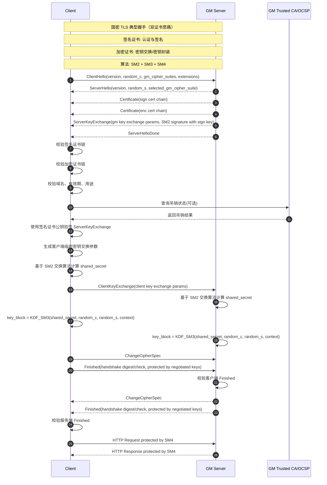

```mermaid
sequenceDiagram
    autonumber
    participant C as Client
    participant S as GM Server
    participant GCA as GM Trusted CA/OCSP

    Note over C,S: 国密 TLS 典型握手（双证书思路）
    Note over C,S: 签名证书: 认证与签名
    Note over C,S: 加密证书: 密钥交换/密钥封装
    Note over C,S: 算法: SM2 + SM3 + SM4

    C->>S: ClientHello(version, random_c, gm_cipher_suites, extensions)
    S-->>C: ServerHello(version, random_s, selected_gm_cipher_suite)
    S-->>C: Certificate(sign cert chain)
    S-->>C: Certificate(enc cert chain)
    S-->>C: ServerKeyExchange(gm key exchange params, SM2 signature with sign key)
    S-->>C: ServerHelloDone

    C->>C: 校验签名证书链
    C->>C: 校验加密证书链
    C->>C: 校验域名、有效期、用途
    C->>GCA: 查询吊销状态(可选)
    GCA-->>C: 返回吊销结果
    C->>C: 使用签名证书公钥验签 ServerKeyExchange
    C->>C: 生成客户端临时密钥交换参数
    C->>C: 基于 SM2 交换算法计算 shared_secret

    C->>S: ClientKeyExchange(client key exchange params)

    S->>S: 基于 SM2 交换算法计算 shared_secret
    C->>C: key_block = KDF_SM3(shared_secret, random_c, random_s, context)
    S->>S: key_block = KDF_SM3(shared_secret, random_c, random_s, context)

    C->>S: ChangeCipherSpec
    C->>S: Finished(handshake digest/check, protected by negotiated keys)
    S->>S: 校验客户端 Finished
    S-->>C: ChangeCipherSpec
    S-->>C: Finished(handshake digest/check, protected by negotiated keys)
    C->>C: 校验服务端 Finished

    C->>S: HTTP Request protected by SM4
    S-->>C: HTTP Response protected by SM4
```