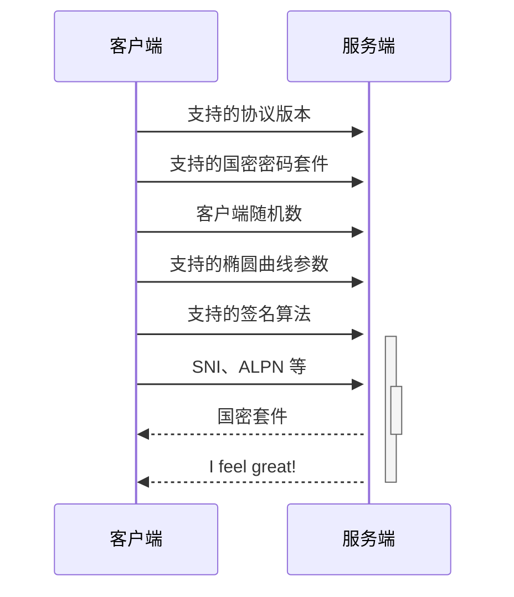

```mermaid
sequenceDiagram
    客户端->>+服务端: 支持的协议版本
    客户端->>+服务端: 支持的国密密码套件
    客户端->>+服务端: 客户端随机数
    客户端->>+服务端: 支持的椭圆曲线参数
    客户端->>+服务端: 支持的签名算法
    客户端->>+服务端: SNI、ALPN 等

    服务端-->>-客户端: 国密套件
    服务端-->>-客户端: I feel great!
            
```