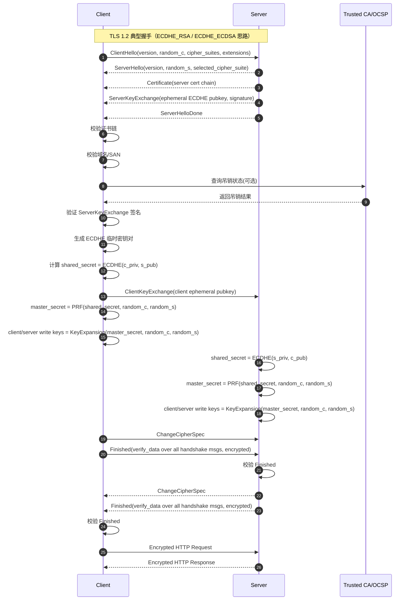

```mermaid
sequenceDiagram
    autonumber
    participant C as Client
    participant S as Server
    participant CA as Trusted CA/OCSP

    Note over C,S: TLS 1.2 典型握手（ECDHE_RSA / ECDHE_ECDSA 思路）

    C->>S: ClientHello(version, random_c, cipher_suites, extensions)
    S-->>C: ServerHello(version, random_s, selected_cipher_suite)
    S-->>C: Certificate(server cert chain)
    S-->>C: ServerKeyExchange(ephemeral ECDHE pubkey, signature)
    S-->>C: ServerHelloDone

    C->>C: 校验证书链
    C->>C: 校验域名/SAN
    C->>CA: 查询吊销状态(可选)
    CA-->>C: 返回吊销结果
    C->>C: 验证 ServerKeyExchange 签名
    C->>C: 生成 ECDHE 临时密钥对
    C->>C: 计算 shared_secret = ECDHE(c_priv, s_pub)

    C->>S: ClientKeyExchange(client ephemeral pubkey)

    C->>C: master_secret = PRF(shared_secret, random_c, random_s)
    C->>C: client/server write keys = KeyExpansion(master_secret, random_c, random_s)
    S->>S: shared_secret = ECDHE(s_priv, c_pub)
    S->>S: master_secret = PRF(shared_secret, random_c, random_s)
    S->>S: client/server write keys = KeyExpansion(master_secret, random_c, random_s)

    C->>S: ChangeCipherSpec
    C->>S: Finished(verify_data over all handshake msgs, encrypted)
    S->>S: 校验 Finished
    S-->>C: ChangeCipherSpec
    S-->>C: Finished(verify_data over all handshake msgs, encrypted)
    C->>C: 校验 Finished

    C->>S: Encrypted HTTP Request
    S-->>C: Encrypted HTTP Response

```