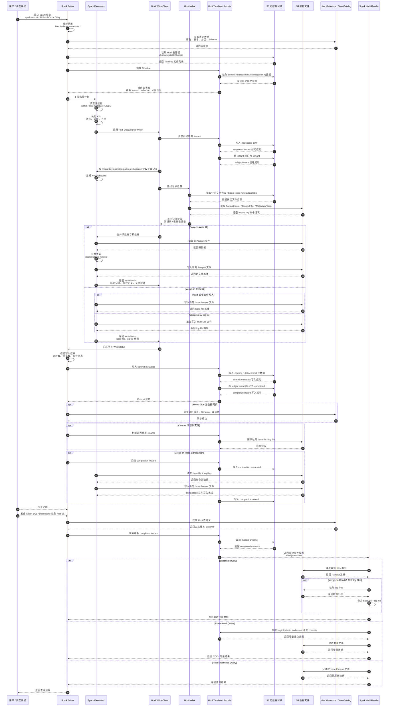

```mermaid
sequenceDiagram
    autonumber

    participant User as 用户 / 调度系统
    participant SparkDriver as Spark Driver
    participant SparkExecutor as Spark Executors
    participant HudiWriter as Hudi Write Client
    participant HudiIndex as Hudi Index
    participant HudiTimeline as Hudi Timeline / .hoodie
    participant S3Meta as S3 元数据目录
    participant S3Data as S3 数据文件
    participant HiveMeta as Hive Metastore / Glue Catalog
    participant SparkReader as Spark Hudi Reader

    %% =========================
    %% 作业提交
    %% =========================

    User ->> SparkDriver: 提交 Spark 作业<br/>spark-submit / Airflow / Oozie / Livy
    SparkDriver ->> SparkDriver: 解析配置<br/>hoodie.datasource.write.*
    SparkDriver ->> HiveMeta: 获取表元数据<br/>库名、表名、分区、Schema
    HiveMeta -->> SparkDriver: 返回表定义

    SparkDriver ->> S3Meta: 读取 Hudi 表路径<br/>s3://bucket/table/.hoodie
    S3Meta -->> SparkDriver: 返回 Timeline 文件列表

    SparkDriver ->> HudiTimeline: 加载 Timeline
    HudiTimeline ->> S3Meta: 读取 commit / deltacommit / compaction 元数据
    S3Meta -->> HudiTimeline: 返回历史提交信息

    HudiTimeline -->> SparkDriver: 当前表状态<br/>最新 instant、schema、分区信息

    %% =========================
    %% Spark 生成待写数据
    %% =========================

    SparkDriver ->> SparkExecutor: 下发执行计划
    SparkExecutor ->> SparkExecutor: 读取源数据<br/>Kafka / Hive / Parquet / JDBC
    SparkExecutor ->> SparkExecutor: 执行 ETL<br/>清洗、转换、去重

    SparkExecutor ->> HudiWriter: 调用 Hudi DataSource Writer

    %% =========================
    %% Hudi 写入初始化
    %% =========================

    HudiWriter ->> HudiTimeline: 请求创建新的 instant
    HudiTimeline ->> S3Meta: 写入 .requested 文件
    S3Meta -->> HudiTimeline: requested instant 创建成功

    HudiTimeline ->> S3Meta: 将 instant 标记为 .inflight
    S3Meta -->> HudiTimeline: inflight instant 创建成功

    HudiWriter ->> SparkExecutor: 按 record key / partition path / preCombine 字段处理记录
    SparkExecutor ->> SparkExecutor: 生成 HoodieRecord

    %% =========================
    %% 索引查找
    %% =========================

    HudiWriter ->> HudiIndex: 查找记录位置
    HudiIndex ->> S3Meta: 读取分区文件列表 / bloom index / metadata table
    S3Meta -->> HudiIndex: 返回候选文件信息

    HudiIndex ->> S3Data: 读取 Parquet footer / Bloom Filter / Metadata Table
    S3Data -->> HudiIndex: 返回 record key 命中情况

    HudiIndex -->> HudiWriter: 返回记录位置<br/>新记录 / 已存在记录

    %% =========================
    %% 写入路径判断
    %% =========================

    alt Copy-on-Write 表
        HudiWriter ->> SparkExecutor: 合并旧数据与新数据
        SparkExecutor ->> S3Data: 读取旧 Parquet 文件
        S3Data -->> SparkExecutor: 返回旧数据

        SparkExecutor ->> SparkExecutor: 合并更新<br/>insert / update / delete
        SparkExecutor ->> S3Data: 写入新的 Parquet 文件
        S3Data -->> SparkExecutor: 返回新文件路径

        SparkExecutor ->> HudiWriter: 返回 WriteStatus<br/>成功记录、失败记录、文件统计

    else Merge-on-Read 表
        alt Insert 或小文件写入
            SparkExecutor ->> S3Data: 写入新的 base Parquet 文件
            S3Data -->> SparkExecutor: 返回 base file 路径
        else Update 写入 log file
            SparkExecutor ->> S3Data: 追加写入 Hudi Log 文件
            S3Data -->> SparkExecutor: 返回 log file 路径
        end

        SparkExecutor ->> HudiWriter: 返回 WriteStatus<br/>base file / log file 信息
    end

    %% =========================
    %% Commit 提交
    %% =========================

    HudiWriter ->> SparkDriver: 汇总所有 WriteStatus
    SparkDriver ->> SparkDriver: 校验写入结果<br/>失败数、重复数、统计信息

    SparkDriver ->> HudiTimeline: 写入 commit metadata
    HudiTimeline ->> S3Meta: 写入 .commit / .deltacommit 元数据
    S3Meta -->> HudiTimeline: commit metadata 写入成功

    HudiTimeline ->> S3Meta: 将 inflight instant 标记为 completed
    S3Meta -->> HudiTimeline: completed instant 写入成功

    HudiTimeline -->> SparkDriver: Commit 成功

    %% =========================
    %% 元数据同步
    %% =========================

    opt Hive / Glue 元数据同步
        SparkDriver ->> HiveMeta: 同步分区信息、Schema、表属性
        HiveMeta -->> SparkDriver: 同步成功
    end

    %% =========================
    %% 清理与异步服务
    %% =========================

    opt Cleaner 清理旧文件
        SparkDriver ->> HudiTimeline: 判断是否触发 cleaner
        HudiTimeline ->> S3Data: 删除过期 base file / log file
        S3Data -->> HudiTimeline: 删除完成
    end

    opt Merge-on-Read Compaction
        SparkDriver ->> HudiTimeline: 调度 compaction instant
        HudiTimeline ->> S3Meta: 写入 compaction requested
        SparkExecutor ->> S3Data: 读取 base file + log files
        S3Data -->> SparkExecutor: 返回待合并数据
        SparkExecutor ->> S3Data: 写入新的 base Parquet 文件
        S3Data -->> SparkExecutor: compaction 文件写入完成
        HudiTimeline ->> S3Meta: 写入 compaction commit
    end

    User -->> SparkDriver: 作业完成

    %% =========================
    %% 读取流程
    %% =========================

    User ->> SparkDriver: 发起 Spark SQL / DataFrame 读取 Hudi 表
    SparkDriver ->> HiveMeta: 获取 Hudi 表定义
    HiveMeta -->> SparkDriver: 返回表路径与 Schema

    SparkDriver ->> HudiTimeline: 加载最新 completed instant
    HudiTimeline ->> S3Meta: 读取 .hoodie timeline
    S3Meta -->> HudiTimeline: 返回 completed commits

    HudiTimeline -->> SparkReader: 返回有效文件视图<br/>FileSystemView

    alt Snapshot Query
        SparkReader ->> S3Data: 读取最新 base files
        S3Data -->> SparkReader: 返回 Parquet 数据

        opt Merge-on-Read 表存在 log files
            SparkReader ->> S3Data: 读取 log files
            S3Data -->> SparkReader: 返回增量日志
            SparkReader ->> SparkReader: 合并 base file + log file
        end

        SparkReader -->> SparkDriver: 返回最新快照数据

    else Incremental Query
        SparkReader ->> HudiTimeline: 根据 beginInstant / endInstant 过滤 commits
        HudiTimeline -->> SparkReader: 返回增量提交范围
        SparkReader ->> S3Data: 读取变更文件
        S3Data -->> SparkReader: 返回增量数据
        SparkReader -->> SparkDriver: 返回 CDC / 增量结果

    else Read Optimized Query
        SparkReader ->> S3Data: 只读取 base Parquet 文件
        S3Data -->> SparkReader: 返回已压缩数据
        SparkReader -->> SparkDriver: 返回查询结果
    end

    SparkDriver -->> User: 返回查询结果

```