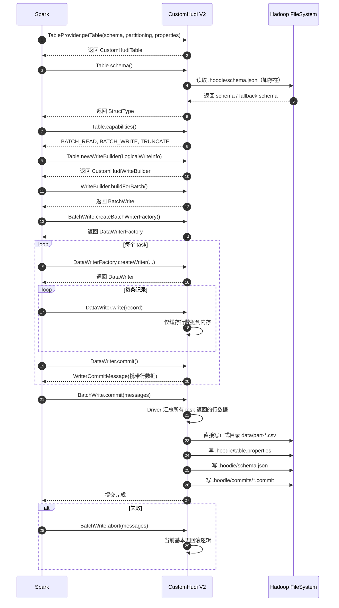

```mermaid
sequenceDiagram
    autonumber

    participant Spark
    participant DSv2 as CustomHudi V2
    participant Storage as Hadoop FileSystem

    Spark->>DSv2: TableProvider.getTable(schema, partitioning, properties)
    DSv2-->>Spark: 返回 CustomHudiTable

    Spark->>DSv2: Table.schema()
    DSv2->>Storage: 读取 .hoodie/schema.json（如存在）
    Storage-->>DSv2: 返回 schema / fallback schema
    DSv2-->>Spark: 返回 StructType

    Spark->>DSv2: Table.capabilities()
    DSv2-->>Spark: BATCH_READ, BATCH_WRITE, TRUNCATE

    Spark->>DSv2: Table.newWriteBuilder(LogicalWriteInfo)
    DSv2-->>Spark: 返回 CustomHudiWriteBuilder

    Spark->>DSv2: WriteBuilder.buildForBatch()
    DSv2-->>Spark: 返回 BatchWrite

    Spark->>DSv2: BatchWrite.createBatchWriterFactory()
    DSv2-->>Spark: 返回 DataWriterFactory

    loop 每个 task
        Spark->>DSv2: DataWriterFactory.createWriter(...)
        DSv2-->>Spark: 返回 DataWriter

        loop 每条记录
            Spark->>DSv2: DataWriter.write(record)
            DSv2->>DSv2: 仅缓存行数据到内存
        end

        Spark->>DSv2: DataWriter.commit()
        DSv2-->>Spark: WriterCommitMessage(携带行数据)
    end

    Spark->>DSv2: BatchWrite.commit(messages)
    DSv2->>DSv2: Driver 汇总所有 task 返回的行数据
    DSv2->>Storage: 直接写正式目录 data/part-*.csv
    DSv2->>Storage: 写 .hoodie/table.properties
    DSv2->>Storage: 写 .hoodie/schema.json
    DSv2->>Storage: 写 .hoodie/commits/*.commit
    DSv2-->>Spark: 提交完成

    alt 失败
        Spark->>DSv2: BatchWrite.abort(messages)
        DSv2->>DSv2: 当前基本无回滚逻辑
    end
```