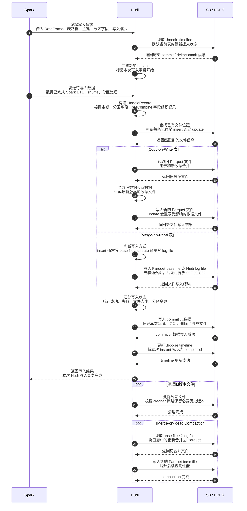

```mermaid
```mermaid
sequenceDiagram
    autonumber

    participant Spark
    participant Hudi
    participant Storage as S3 / HDFS

    Spark ->> Hudi: 发起写入请求<br/>传入 DataFrame、表路径、主键、分区字段、写入模式
    Hudi ->> Storage: 读取 .hoodie timeline<br/>确认当前表的最新提交状态
    Storage -->> Hudi: 返回历史 commit / deltacommit 信息

    Hudi ->> Hudi: 生成新的 instant<br/>标记本次写入事务开始

    Spark ->> Hudi: 发送待写入数据<br/>数据已完成 Spark ETL、shuffle、分区处理
    Hudi ->> Hudi: 构造 HoodieRecord<br/>根据主键、分区字段、preCombine 字段组织记录

    Hudi ->> Storage: 查找已有文件位置<br/>判断每条记录是 insert 还是 update
    Storage -->> Hudi: 返回匹配到的文件信息

    alt Copy-on-Write 表
        Hudi ->> Storage: 读取旧 Parquet 文件<br/>用于和新数据合并
        Storage -->> Hudi: 返回旧数据文件

        Hudi ->> Hudi: 合并旧数据和新数据<br/>生成最新版本的数据文件
        Hudi ->> Storage: 写入新的 Parquet 文件<br/>update 会重写受影响的数据文件
        Storage -->> Hudi: 返回新文件写入结果

    else Merge-on-Read 表
        Hudi ->> Hudi: 判断写入方式<br/>insert 通常写 base file，update 通常写 log file
        Hudi ->> Storage: 写入 Parquet base file 或 Hudi log file<br/>先快速落盘，后续可异步 compaction
        Storage -->> Hudi: 返回文件写入结果
    end

    Hudi ->> Hudi: 汇总写入状态<br/>统计成功、失败、文件大小、分区变更
    Hudi ->> Storage: 写入 commit 元数据<br/>记录本次新增、更新、删除了哪些文件
    Storage -->> Hudi: commit 元数据写入成功

    Hudi ->> Storage: 更新 .hoodie timeline<br/>将本次 instant 标记为 completed
    Storage -->> Hudi: timeline 更新成功

    Hudi -->> Spark: 返回写入结果<br/>本次 Hudi 写入事务完成

    opt 清理旧版本文件
        Hudi ->> Storage: 删除过期文件<br/>根据 cleaner 策略保留必要历史版本
        Storage -->> Hudi: 清理完成
    end

    opt Merge-on-Read Compaction
        Hudi ->> Storage: 读取 base file 和 log file<br/>将日志中的更新合并回 Parquet
        Storage -->> Hudi: 返回待合并文件

        Hudi ->> Storage: 写入新的 Parquet base file<br/>提升后续查询性能
        Storage -->> Hudi: compaction 完成
    end

```
```