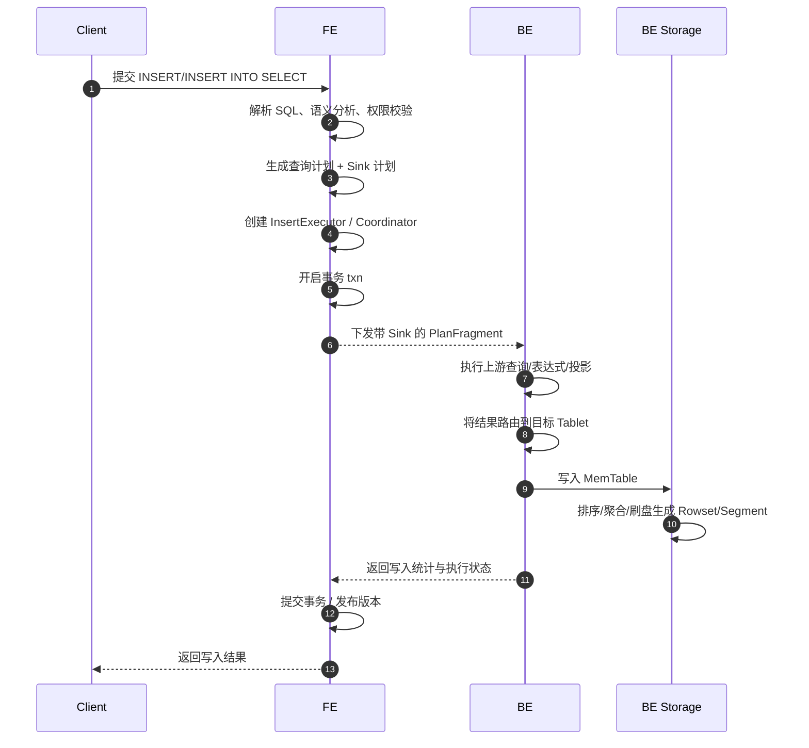

```mermaid
sequenceDiagram
    autonumber
    participant Client
    participant FE
    participant BE
    participant Storage as BE Storage

    Client->>FE: 提交 INSERT/INSERT INTO SELECT
    FE->>FE: 解析 SQL、语义分析、权限校验
    FE->>FE: 生成查询计划 + Sink 计划
    FE->>FE: 创建 InsertExecutor / Coordinator
    FE->>FE: 开启事务 txn
    FE-->>BE: 下发带 Sink 的 PlanFragment

    BE->>BE: 执行上游查询/表达式/投影
    BE->>BE: 将结果路由到目标 Tablet
    BE->>Storage: 写入 MemTable
    Storage->>Storage: 排序/聚合/刷盘生成 Rowset/Segment
    BE-->>FE: 返回写入统计与执行状态

    FE->>FE: 提交事务 / 发布版本
    FE-->>Client: 返回写入结果

```