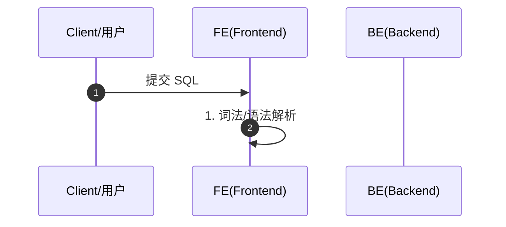

```mermaid
sequenceDiagram
    autonumber

    participant Client as Client/用户
    participant FE as FE(Frontend)
    participant BE as BE(Backend)
    
    Client->>FE: 提交 SQL
    FE->>FE: 1. 词法/语法解析
```