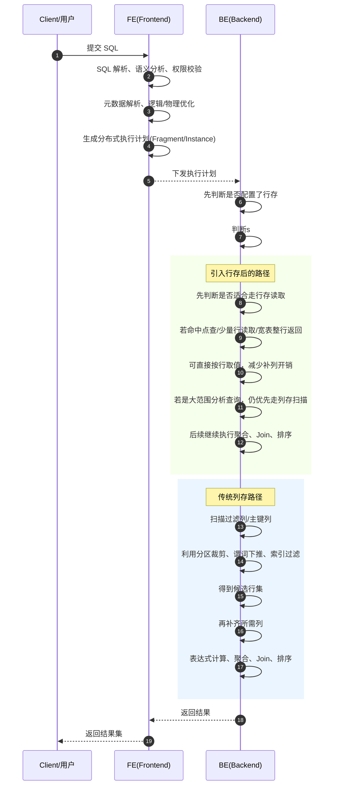

```mermaid
sequenceDiagram
    autonumber

    participant Client as Client/用户
    participant FE as FE(Frontend)
    participant BE as BE(Backend)
    
    Client->>FE: 提交 SQL
    FE->>FE: SQL 解析、语义分析、权限校验
    FE->>FE: 元数据解析、逻辑/物理优化
    FE->>FE: 生成分布式执行计划(Fragment/Instance)
    FE-->>BE: 下发执行计划

    BE->>BE: 先判断是否配置了行存
    BE->>BE: 判断s


    rect rgb(245,255,235)
        Note over BE: 引入行存后的路径
        BE->>BE: 先判断是否适合走行存读取
        BE->>BE: 若命中点查/少量行读取/宽表整行返回
        BE->>BE: 可直接按行取值，减少补列开销
        BE->>BE: 若是大范围分析查询，仍优先走列存扫描
        BE->>BE: 后续继续执行聚合、Join、排序
    end


    rect rgb(235,245,255)
        Note over BE: 传统列存路径
        BE->>BE: 扫描过滤列/主键列
        BE->>BE: 利用分区裁剪、谓词下推、索引过滤
        BE->>BE: 得到候选行集
        BE->>BE: 再补齐所需列
        BE->>BE: 表达式计算、聚合、Join、排序
    end

    BE-->>FE: 返回结果
    FE-->>Client: 返回结果集


```