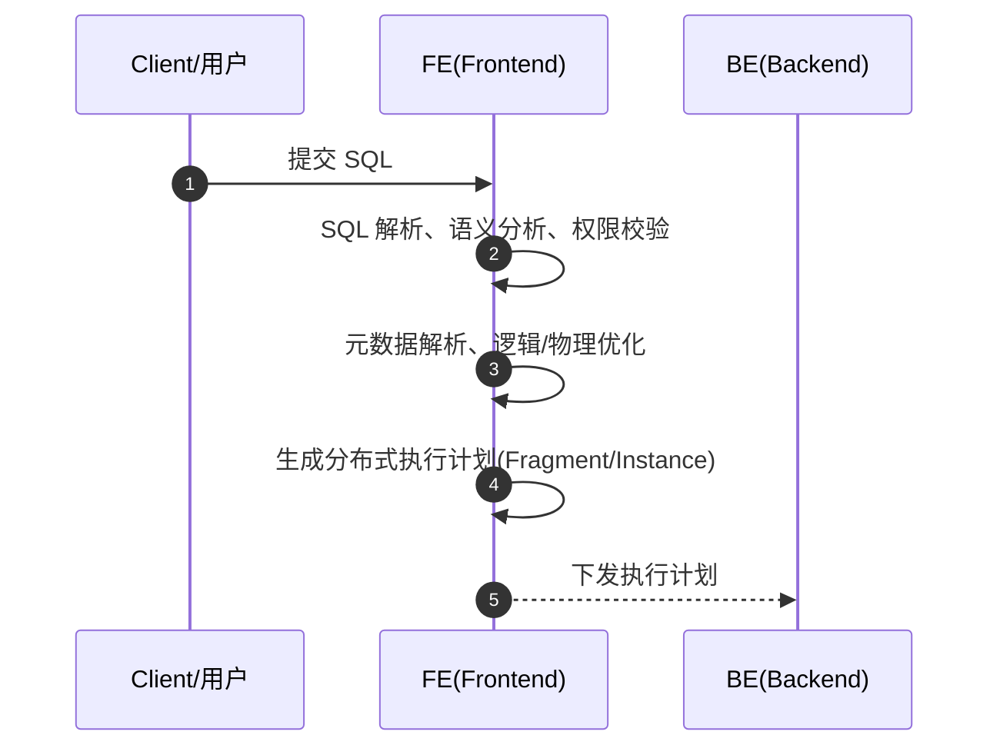

```mermaid
sequenceDiagram
    autonumber

    participant Client as Client/用户
    participant FE as FE(Frontend)
    participant BE as BE(Backend)
    
    Client->>FE: 提交 SQL
    FE->>FE: SQL 解析、语义分析、权限校验
    FE->>FE: 元数据解析、逻辑/物理优化
    FE->>FE: 生成分布式执行计划(Fragment/Instance)
    FE-->>BE: 下发执行计划
```