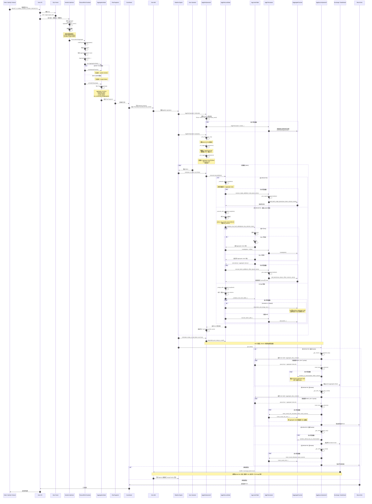

```mermaid
sequenceDiagram
    autonumber

    participant Client as Client / MySQL Protocol
    participant FE as Doris FE
    participant Parser as SQL Parser
    participant Nereids as Nereids Optimizer
    participant Translator as PhysicalPlanTranslator
    participant AggNode as AggregationNode
    participant Fragment as PlanFragment
    participant Coordinator as Coordinator
    participant BE as Doris BE
    participant Pipeline as Pipeline Engine
    participant Scan as Scan Operator
    participant AggSink as AggSinkOperatorX
    participant AggState as AggSinkLocalState
    participant HashTable as Agg HashTable
    participant AggEval as AggFnEvaluator
    participant AggFunc as IAggregateFunction
    participant AggSource as AggSourceOperatorX
    participant Exchange as Exchange / DataStream
    participant Result as Result Sink

    Client->>FE: 发送查询 SQL<br/>SELECT k, SUM(v), COUNT(*) FROM t GROUP BY k

    FE->>Parser: 解析 SQL
    Parser-->>FE: AST / logical query tree

    FE->>Nereids: 语义分析 + 逻辑优化 + 物理优化

    Nereids->>Nereids: 识别 Aggregate<br/>group by: k<br/>aggregate: sum(v), count(*)

    Nereids->>Nereids: 选择聚合策略
    Note over Nereids: 可能生成多阶段聚合：<br/>LOCAL update serialize<br/>GLOBAL merge finalize

    Nereids-->>Translator: PhysicalHashAggregate

    Translator->>Translator: visitPhysicalHashAggregate()

    Translator->>Translator: 构造 group exprs
    Translator->>Translator: 构造 aggregate function exprs

    Translator->>Translator: AggregateInfo.create(...)
    Translator->>AggNode: new AggregationNode(...)

    alt partial / local 阶段
        Translator->>AggNode: unsetNeedsFinalize()
        Note over AggNode: 节点语义：update serialize
    else final / global 阶段
        Note over AggNode: 节点语义：merge finalize
    end

    Translator->>AggNode: toThrift(TPlanNode)
    AggNode->>AggNode: 写入 TAggregationNode
    Note over AggNode: aggregate_functions<br/>grouping_exprs<br/>needs_finalize<br/>is_first_phase<br/>use_streaming_preaggregation

    AggNode-->>Fragment: 挂到 PlanFragment
    Fragment-->>Coordinator: 查询执行计划

    Coordinator->>BE: 下发 fragment instance<br/>包含 TPlanNode.AGGREGATION_NODE

    BE->>Pipeline: 构建 pipeline operators

    Pipeline->>AggSink: AggSinkOperatorX::init(tnode)
    AggSink->>AggSink: 创建 group by 表达式树<br/>VExpr::create_expr_trees(grouping_exprs)

    loop 每个聚合函数
        AggSink->>AggEval: AggFnEvaluator::create(...)
        AggEval->>AggFunc: 根据函数名创建具体聚合函数<br/>sum/count/avg/min/max...
    end

    Pipeline->>AggSink: AggSinkOperatorX::prepare()
    AggSink->>AggSink: _init_probe_expr_ctx()
    Note over AggSink: 准备 group by key 表达式

    AggSink->>AggSink: _init_aggregate_evaluators()
    Note over AggSink: 准备每个 AggFnEvaluator<br/>绑定输入 slot / 输出 slot

    AggSink->>AggSink: _calc_aggregate_evaluators()
    Note over AggSink: 计算每个 aggregate state 的 offset<br/>total state size<br/>内存对齐

    loop 扫描输入 block
        Scan->>Pipeline: 输出 Block

        Pipeline->>AggSink: sink(state, in_block, eos=false)

        AggSink->>AggState: executor.execute(block)

        alt 无 GROUP BY
            AggState->>AggState: _execute_without_key(block)
            Note over AggState: 所有行更新同一个 aggregate state

            loop 每个聚合函数
                AggState->>AggEval: execute_single_add(block, state_place, arena)
                AggEval->>AggEval: _calc_argument_columns(block)
                AggEval->>AggFunc: add_batch_single_place(rows, place, columns, arena)
                AggFunc-->>AggState: 更新聚合状态
            end

        else 有 GROUP BY，普通 update 阶段
            AggState->>AggState: _execute_with_serialized_key(block)

            AggState->>AggState: 执行 group by 表达式
            Note over AggState: probe_expr_ctxs[i]->execute(block)<br/>得到 key columns

            AggState->>HashTable: _emplace_into_hash_table(places, key_columns, rows)

            loop 每一行 key
                HashTable->>HashTable: 查找 group key
                alt key 不存在
                    HashTable->>HashTable: 插入 key
                    HashTable->>AggState: 分配 aggregate state 内存
                    AggState->>AggEval: create(place + offset)
                    AggEval->>AggFunc: create(place)
                else key 已存在
                    HashTable-->>AggState: 返回已有 aggregate state 地址
                end
            end

            HashTable-->>AggState: places[row] = aggregate state ptr

            loop 每个聚合函数
                AggState->>AggEval: execute_batch_add(block, offset, places, arena)
                AggEval->>AggEval: _calc_argument_columns(block)
                AggEval->>AggFunc: add_batch(rows, places, offset, columns, arena)
                AggFunc-->>AggState: 批量更新每个 group 的 state
            end

        else merge 阶段
            AggState->>AggState: _merge_with_serialized_key(block)

            AggState->>AggState: 执行 / 读取 group by key columns
            AggState->>HashTable: _emplace_into_hash_table(...)

            loop 每个聚合函数
                alt evaluator.is_merge()
                    AggState->>AggFunc: deserialize_and_merge_vec(...)
                    Note over AggFunc: 从上游 serialized aggregate state<br/>反序列化并 merge 到本地 state
                else 普通 add
                    AggState->>AggEval: execute_batch_add(...)
                    AggEval->>AggFunc: add_batch(...)
                end
            end
        end

        AggState-->>AggSink: 当前 block 聚合完成
        AggSink->>AggSink: 更新内存 / hash table profile counter
    end

    Pipeline->>AggSink: sink(state, empty_or_last_block, eos=true)
    AggSink->>AggState: dependency.set_ready_to_read()
    Note over AggSink,AggSource: Sink 完成后，Source 才能开始读聚合结果

    Pipeline->>AggSource: get_block()

    alt 有 GROUP BY 且非 finalize
        AggSource->>AggSource: _get_results_with_serialized_key()
        AggSource->>HashTable: 遍历 hash table / aggregate_data_container

        loop 每批最多 batch_size 个 group
            HashTable-->>AggSource: group keys + aggregate state ptrs
            AggSource->>AggSource: insert_keys_into_columns()

            loop 每个聚合函数
                AggSource->>AggFunc: serialize_to_column(states, offset, column)
                Note over AggFunc: 输出 serialized aggregate state<br/>供下一阶段 merge
            end

            AggSource-->>Exchange: 输出 partial aggregation Block
        end

    else 有 GROUP BY 且 finalize
        AggSource->>AggSource: _get_with_serialized_key_result()
        AggSource->>HashTable: 遍历 hash table / aggregate_data_container

        loop 每批最多 batch_size 个 group
            HashTable-->>AggSource: group keys + aggregate state ptrs
            AggSource->>AggSource: insert_keys_into_columns()

            loop 每个聚合函数
                AggSource->>AggEval: insert_result_info_vec(states, offset, result_column)
                AggEval->>AggFunc: insert_result_into_vec(...)
                Note over AggFunc: 把 aggregate state 转成最终 SQL 结果值
            end

            AggSource-->>Result: 输出最终结果 Block
        end

    else 无 GROUP BY 且非 finalize
        AggSource->>AggSource: _get_results_without_key()
        loop 每个聚合函数
            AggSource->>AggFunc: serialize_without_key_to_column(state)
        end
        AggSource-->>Exchange: 输出单行 serialized state

    else 无 GROUP BY 且 finalize
        AggSource->>AggSource: _get_without_key_result()
        loop 每个聚合函数
            AggSource->>AggEval: insert_result_info(state, result_column)
            AggEval->>AggFunc: insert_result_into(...)
        end
        AggSource-->>Result: 输出单行最终结果
    end

    alt 多阶段聚合
        Exchange->>BE: shuffle / exchange partial result
        Note over Exchange,BE: 通常按 group key 分发，保证同一 key 进入同一个 final agg 实例
        BE->>Pipeline: 下游 fragment 继续执行 merge finalize 聚合
    else 单阶段聚合
        Result->>Coordinator: 返回结果 Block
    end

    Coordinator->>FE: 汇总结果
    FE->>Client: 返回查询结果

```