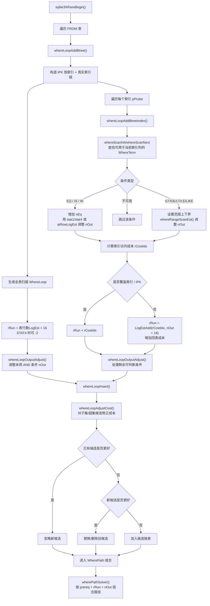

```mermaid
flowchart TD
  A["sqlite3WhereBegin()"] --> B["遍历 FROM 表"]
  B --> C["whereLoopAddBtree()"]

  C --> D["构造 IPK 假索引 + 真实索引链"]
  D --> E["生成全表扫描 WhereLoop"]
  E --> E1["rRun = 表行数LogEst + 16\nSTAT4 时可 -2"]
  E1 --> E2["whereLoopOutputAdjust()\n调整未用 AND 条件 nOut"]
  E2 --> I["whereLoopInsert()"]

  D --> F["遍历每个索引 pProbe"]
  F --> G["whereLoopAddBtreeIndex()"]
  G --> H["whereScanInit/whereScanNext\n查找可用于当前索引列的 WhereTerm"]
  H --> H1{"条件类型"}
  H1 -->|EQ / IS / IN| H2["增加 nEq\n用 stat1/stat4 或 aiRowLogEst 调整 nOut"]
  H1 -->|GT/GE/LT/LE/LIKE| H3["设置范围上下界\nwhereRangeScanEst() 调整 nOut"]
  H1 -->|不可用| H4["跳过该条件"]

  H2 --> J["计算索引访问成本 rCostIdx"]
  H3 --> J
  J --> K{"是否覆盖索引 / IPK"}
  K -->|是| L["rRun = rCostIdx"]
  K -->|否| M["rRun = LogEstAdd(rCostIdx, nOut + 16)\n增加回表成本"]
  L --> N["whereLoopOutputAdjust()\n处理剩余可判断条件"]
  M --> N
  N --> I

  I --> O["whereLoopAdjustCost()\n对子集/超集候选修正成本"]
  O --> P{"已有候选是否更好"}
  P -->|是| Q["忽略新候选"]
  P -->|否| R{"新候选是否更好"}
  R -->|是| S["替换/删除旧候选"]
  R -->|否| T["加入候选链表"]

  Q --> U["进入 WherePath 组合"]
  S --> U
  T --> U
  U --> V["wherePathSolver()\n按 prereq + rRun + nOut 组合路径"]

```