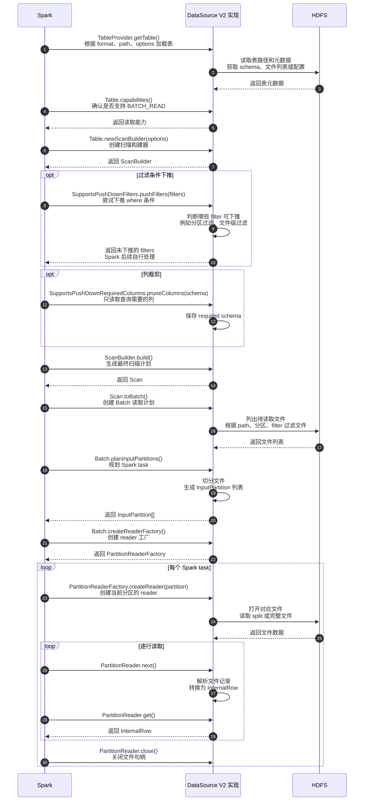

```mermaid
sequenceDiagram
    autonumber

    participant Spark
    participant DSv2 as DataSource V2 实现
    participant HDFS

    Spark ->> DSv2: TableProvider.getTable()<br/>根据 format、path、options 加载表
    DSv2 ->> HDFS: 读取表路径和元数据<br/>获取 schema、文件列表或配置
    HDFS -->> DSv2: 返回表元数据

    Spark ->> DSv2: Table.capabilities()<br/>确认是否支持 BATCH_READ
    DSv2 -->> Spark: 返回读取能力

    Spark ->> DSv2: Table.newScanBuilder(options)<br/>创建扫描构建器
    DSv2 -->> Spark: 返回 ScanBuilder

    opt 过滤条件下推
        Spark ->> DSv2: SupportsPushDownFilters.pushFilters(filters)<br/>尝试下推 where 条件
        DSv2 ->> DSv2: 判断哪些 filter 可下推<br/>例如分区过滤、文件级过滤
        DSv2 -->> Spark: 返回未下推的 filters<br/>Spark 后续自行处理
    end

    opt 列裁剪
        Spark ->> DSv2: SupportsPushDownRequiredColumns.pruneColumns(schema)<br/>只读取查询需要的列
        DSv2 ->> DSv2: 保存 required schema
    end

    Spark ->> DSv2: ScanBuilder.build()<br/>生成最终扫描计划
    DSv2 -->> Spark: 返回 Scan

    Spark ->> DSv2: Scan.toBatch()<br/>创建 Batch 读取计划
    DSv2 ->> HDFS: 列出待读取文件<br/>根据 path、分区、filter 过滤文件
    HDFS -->> DSv2: 返回文件列表

    Spark ->> DSv2: Batch.planInputPartitions()<br/>规划 Spark task
    DSv2 ->> DSv2: 切分文件<br/>生成 InputPartition 列表
    DSv2 -->> Spark: 返回 InputPartition[]

    Spark ->> DSv2: Batch.createReaderFactory()<br/>创建 reader 工厂
    DSv2 -->> Spark: 返回 PartitionReaderFactory

    loop 每个 Spark task
        Spark ->> DSv2: PartitionReaderFactory.createReader(partition)<br/>创建当前分区的 reader
        DSv2 ->> HDFS: 打开对应文件<br/>读取 split 或完整文件
        HDFS -->> DSv2: 返回文件数据

        loop 逐行读取
            Spark ->> DSv2: PartitionReader.next()
            DSv2 ->> DSv2: 解析文件记录<br/>转换为 InternalRow
            Spark ->> DSv2: PartitionReader.get()
            DSv2 -->> Spark: 返回 InternalRow
        end

        Spark ->> DSv2: PartitionReader.close()<br/>关闭文件句柄
    end

```