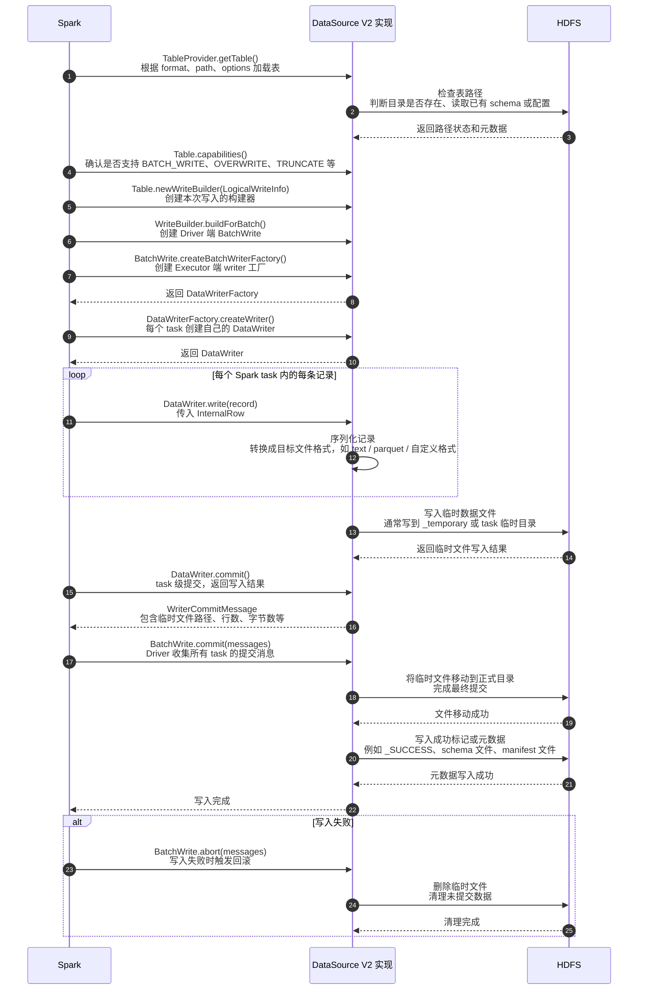

```mermaid
sequenceDiagram
    autonumber

    participant Spark
    participant DSv2 as DataSource V2 实现
    participant HDFS

    Spark ->> DSv2: TableProvider.getTable()<br/>根据 format、path、options 加载表
    DSv2 ->> HDFS: 检查表路径<br/>判断目录是否存在、读取已有 schema 或配置
    HDFS -->> DSv2: 返回路径状态和元数据

    Spark ->> DSv2: Table.capabilities()<br/>确认是否支持 BATCH_WRITE、OVERWRITE、TRUNCATE 等

    Spark ->> DSv2: Table.newWriteBuilder(LogicalWriteInfo)<br/>创建本次写入的构建器

    Spark ->> DSv2: WriteBuilder.buildForBatch()<br/>创建 Driver 端 BatchWrite

    Spark ->> DSv2: BatchWrite.createBatchWriterFactory()<br/>创建 Executor 端 writer 工厂
    DSv2 -->> Spark: 返回 DataWriterFactory

    Spark ->> DSv2: DataWriterFactory.createWriter()<br/>每个 task 创建自己的 DataWriter
    DSv2 -->> Spark: 返回 DataWriter

    loop 每个 Spark task 内的每条记录
        Spark ->> DSv2: DataWriter.write(record)<br/>传入 InternalRow
        DSv2 ->> DSv2: 序列化记录<br/>转换成目标文件格式，如 text / parquet / 自定义格式
    end

    DSv2 ->> HDFS: 写入临时数据文件<br/>通常写到 _temporary 或 task 临时目录
    HDFS -->> DSv2: 返回临时文件写入结果

    Spark ->> DSv2: DataWriter.commit()<br/>task 级提交，返回写入结果
    DSv2 -->> Spark: WriterCommitMessage<br/>包含临时文件路径、行数、字节数等

    Spark ->> DSv2: BatchWrite.commit(messages)<br/>Driver 收集所有 task 的提交消息
    DSv2 ->> HDFS: 将临时文件移动到正式目录<br/>完成最终提交
    HDFS -->> DSv2: 文件移动成功

    DSv2 ->> HDFS: 写入成功标记或元数据<br/>例如 _SUCCESS、schema 文件、manifest 文件
    HDFS -->> DSv2: 元数据写入成功

    DSv2 -->> Spark: 写入完成

    alt 写入失败
        Spark ->> DSv2: BatchWrite.abort(messages)<br/>写入失败时触发回滚
        DSv2 ->> HDFS: 删除临时文件<br/>清理未提交数据
        HDFS -->> DSv2: 清理完成
    end
```