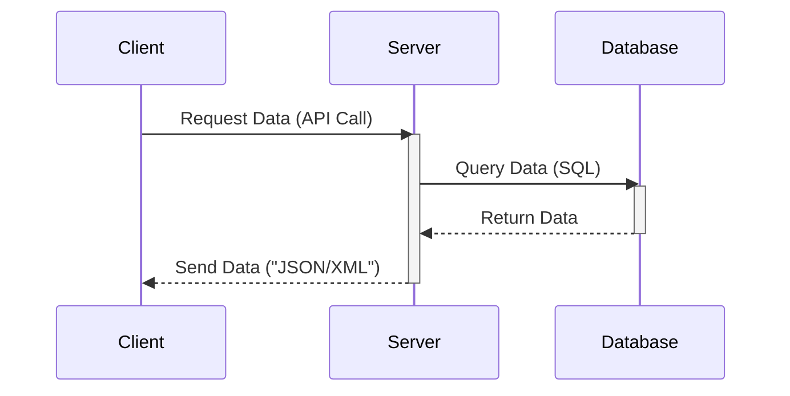

```mermaid
sequenceDiagram
    participant Client
    participant Server
    participant Database

    Client->>Server: Request Data (API Call)
    activate Server
    Server->>Database: Query Data (SQL)
    activate Database
    Database-->>Server: Return Data
    deactivate Database
    Server-->>Client: Send Data ("JSON/XML")
    deactivate Server

```