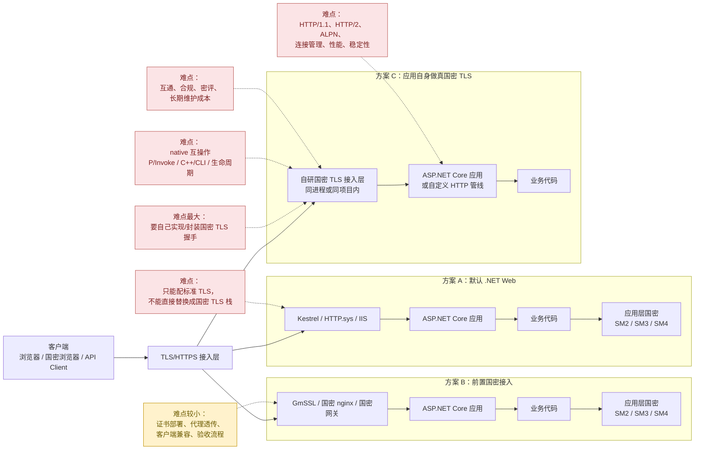

```mermaid
flowchart LR
    C["客户端<br/>浏览器 / 国密浏览器 / API Client"] --> TLS["TLS/HTTPS 接入层"]

    subgraph A["方案 A：默认 .NET Web"]
        TLS1["Kestrel / HTTP.sys / IIS"] --> APP1["ASP.NET Core 应用"]
        APP1 --> BIZ1["业务代码"]
        BIZ1 --> ALG1["应用层国密<br/>SM2 / SM3 / SM4"]
    end

    subgraph B["方案 B：前置国密接入"]
        GMGW["GmSSL / 国密 nginx / 国密网关"] --> DOTNET["ASP.NET Core 应用"]
        DOTNET --> BIZ2["业务代码"]
        BIZ2 --> ALG2["应用层国密<br/>SM2 / SM3 / SM4"]
    end

    subgraph C2["方案 C：应用自身做真国密 TLS"]
        SELF["自研国密 TLS 接入层<br/>同进程或同项目内"] --> APP2["ASP.NET Core 应用<br/>或自定义 HTTP 管线"]
        APP2 --> BIZ3["业务代码"]
    end

    TLS --> TLS1
    TLS --> GMGW
    TLS --> SELF

    H1["难点：<br/>只能配标准 TLS，<br/>不能直接替换成国密 TLS 栈"]:::hard -.-> TLS1
    H2["难点较小：<br/>证书部署、代理透传、<br/>客户端兼容、验收流程"]:::mid -.-> GMGW
    H3["难点最大：<br/>要自己实现/封装国密 TLS 握手"]:::hard -.-> SELF
    H4["难点：<br/>native 互操作<br/>P/Invoke / C++/CLI / 生命周期"]:::hard -.-> SELF
    H5["难点：<br/>HTTP/1.1、HTTP/2、ALPN、<br/>连接管理、性能、稳定性"]:::hard -.-> APP2
    H6["难点：<br/>互通、合规、密评、<br/>长期维护成本"]:::hard -.-> SELF

    classDef hard fill:#fbe4e6,stroke:#b85450,color:#7a1f1f
    classDef mid fill:#fff2cc,stroke:#bf9000,color:#6b5b00

```