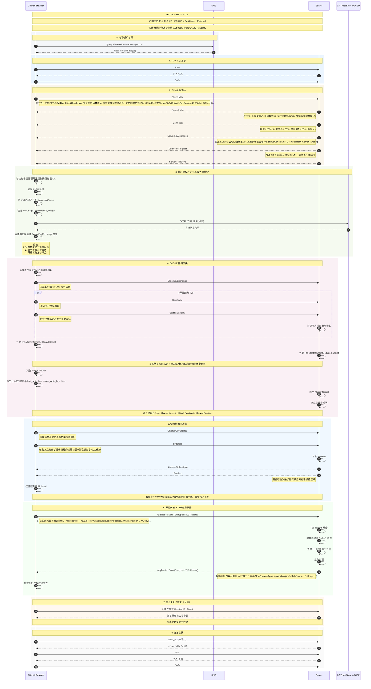

```mermaid
sequenceDiagram
    autonumber
    participant C as Client / Browser
    participant D as DNS
    participant S as Server
    participant CA as CA Trust Store / OCSP

    Note over C,S: HTTPS = HTTP + TLS
    Note over C,S: 示例主线采用 TLS 1.2 + ECDHE + Certificate + Finished
    Note over C,S: 应用数据阶段通常使用 AES-GCM / ChaCha20-Poly1305

    rect rgb(245, 247, 250)
        Note over C,D: 0. 名称解析阶段
        C->>D: Query A/AAAA for www.example.com
        D-->>C: Return IP address(es)
    end

    rect rgb(235, 245, 255)
        Note over C,S: 1. TCP 三次握手
        C->>S: SYN
        S-->>C: SYN-ACK
        C->>S: ACK
    end

    rect rgb(250, 245, 235)
        Note over C,S: 2. TLS 握手开始
        C->>S: ClientHello
        Note right of C: 包含:\n- 支持的 TLS 版本\n- Client Random\n- 支持的密码套件\n- 支持的椭圆曲线/组\n- 支持的签名算法\n- SNI(目标域名)\n- ALPN(h2/http1.1)\n- Session ID / Ticket 信息(可选)

        S-->>C: ServerHello
        Note left of S: 选择:\n- TLS 版本\n- 密码套件\n- Server Random\n- 会话恢复参数(可选)

        S-->>C: Certificate
        Note left of S: 发送证书链:\n- 服务器证书\n- 中间 CA 证书(可选多个)

        S-->>C: ServerKeyExchange
        Note left of S: 发送 ECDHE 临时公钥参数\n并对握手参数签名:\nSign(ServerParams, ClientRandom, ServerRandom)

        S-->>C: CertificateRequest
        Note left of S: 可选\n若开启双向 TLS(mTLS)，要求客户端证书

        S-->>C: ServerHelloDone
    end

    rect rgb(245, 250, 240)
        Note over C,CA: 3. 客户端校验证书与服务端身份
        C->>C: 验证证书链是否可追溯到受信任根 CA
        C->>C: 验证证书有效期
        C->>C: 验证域名是否匹配 SubjectAltName
        C->>C: 验证 KeyUsage / ExtendedKeyUsage
        C->>CA: OCSP / CRL 查询(可选)
        CA-->>C: 吊销状态结果
        C->>C: 用证书公钥验证 ServerKeyExchange 签名
        Note over C: 结论:<br/>1. 对方持有证书对应私钥<br/>2. 握手参数未被篡改<br/>3. 目标域名身份成立
    end

    rect rgb(250, 240, 245)
        Note over C,S: 4. ECDHE 密钥交换
        C->>C: 生成客户端 ECDHE 临时密钥对
        C->>S: ClientKeyExchange
        Note right of C: 发送客户端 ECDHE 临时公钥

        alt 开启双向 TLS
            C->>S: Certificate
            Note right of C: 发送客户端证书链
            C->>S: CertificateVerify
            Note right of C: 用客户端私钥对握手摘要签名
            S->>S: 验证客户端证书与签名
        end

        C->>C: 计算 Pre-Master Secret / Shared Secret
        S->>S: 计算 Pre-Master Secret / Shared Secret
        Note over C,S: 双方基于各自私钥 + 对方临时公钥\n得到相同共享秘密

        C->>C: 派生 Master Secret
        C->>C: 派生会话密钥块\n(client_write_key, server_write_key, IV...)
        S->>S: 派生 Master Secret
        S->>S: 派生会话密钥块
        Note over C,S: 输入通常包括:\n- Shared Secret\n- Client Random\n- Server Random
    end

    rect rgb(240, 248, 255)
        Note over C,S: 5. 切换到加密通信
        C->>S: ChangeCipherSpec
        Note right of C: 后续消息开始使用新协商密钥保护

        C->>S: Finished
        Note right of C: 包含对之前全部握手消息的校验摘要\n并已被加密/认证保护

        S->>S: 校验 Finished
        S-->>C: ChangeCipherSpec
        S-->>C: Finished
        Note left of S: 服务端也发送加密保护后的握手校验结果

        C->>C: 校验服务端 Finished
        Note over C,S: 若双方 Finished 验证通过\n说明握手视图一致、无中间人篡改
    end

    rect rgb(245, 255, 245)
        Note over C,S: 6. 开始传输 HTTP 应用数据
        C->>S: Application Data (Encrypted TLS Record)
        Note right of C: 内部实际内容可能是:\nGET /api/user HTTP/1.1\nHost: www.example.com\nCookie: ...\nAuthorization: ...\nBody: ...

        S->>S: TLS Record 解密
        S->>S: 完整性校验 / AEAD 验证
        S->>S: 还原 HTTP 请求字节流
        S->>S: 业务处理

        S-->>C: Application Data (Encrypted TLS Record)
        Note left of S: 内部实际内容可能是:\nHTTP/1.1 200 OK\nContent-Type: application/json\nSet-Cookie: ...\nBody: {...}

        C->>C: 解密响应并校验完整性
    end

    rect rgb(255, 248, 240)
        Note over C,S: 7. 会话复用 / 恢复（可选）
        C->>S: 后续连接带 Session ID / Ticket
        S-->>C: 恢复已存在会话参数
        Note over C,S: 可减少完整握手开销
    end

    rect rgb(250, 250, 250)
        Note over C,S: 8. 连接关闭
        C->>S: close_notify (可选)
        S-->>C: close_notify (可选)
        C->>S: FIN
        S-->>C: ACK / FIN
        C->>S: ACK
    end

```